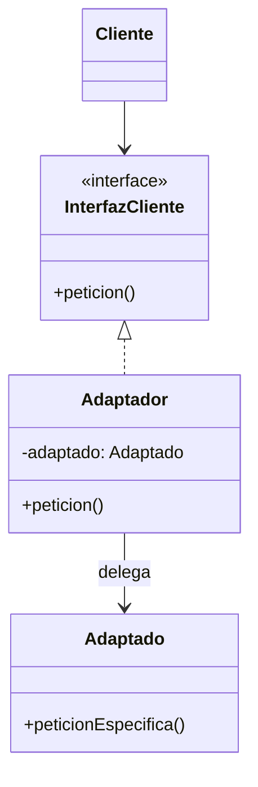

# Adapter (Adaptador)

## ¿Qué es?
El **Adapter** es un patrón de diseño **estructural** que permite que objetos con interfaces incompatibles trabajen juntos. 

Arquitectónicamente, actúa como un traductor o intermediario. Imagina un adaptador de corriente que permite conectar un enchufe europeo en una toma americana; el patrón Adapter hace lo mismo para el software: envuelve un objeto existente con una nueva interfaz que el cliente espera.

## Problema que intenta resolver
El problema surge cuando tienes una clase existente (o una librería de terceros) que ofrece una funcionalidad necesaria, pero su interfaz no coincide con la interfaz que tu sistema utiliza actualmente. 
Modificar la clase original no siempre es posible (si es de una librería) o no es deseable (para no romper código existente).

## Situación sin patrón
Supongamos que tu sistema de facturación espera una interfaz `ProveedorPrecio` que entrega datos en JSON, pero tienes una librería antigua que los entrega en XML:

```java
// Interfaz que el sistema espera
interface ProveedorPrecio {
    String getPrecioJSON();
}

// Librería antigua incompatible
class LibreriaViejaXML {
    public String obtenerDatoXML() { return "<precio>100</precio>"; }
}

// El cliente NO puede usar la librería directamente porque los tipos no coinciden
public class SistemaFacturacion {
    public void procesar(ProveedorPrecio proveedor) {
        String json = proveedor.getPrecioJSON();
        // ... lógica
    }
}
```

### Problemas del diseño ingenuo:
1. **Incompatibilidad:** No puedes pasar un objeto `LibreriaViejaXML` a un método que espera `ProveedorPrecio`.
2. **Acoplamiento:** Si intentas "forzar" la integración modificando el cliente, terminas con código lleno de conversiones manuales y dependencias de implementación.

## Idea principal del patrón
La filosofía es **crear un objeto intermedio (el Adaptador)** que implemente la interfaz que el cliente espera y que, internamente, contenga una instancia del objeto incompatible. El adaptador traduce las llamadas del cliente a un formato que el objeto original entienda.

## Cómo funciona
1. **Cliente:** La clase que contiene la lógica de negocio y usa la interfaz estandarizada.
2. **Interfaz Cliente (Target):** Describe el protocolo que otras clases deben seguir para colaborar con el cliente.
3. **Adaptado (Service/Adaptee):** La clase útil pero incompatible (ej. la librería antigua).
4. **Adaptador:** Una clase que implementa la interfaz del cliente y envuelve al adaptado.

## UML del patrón

### UML Mermaid


## Implementación esencial en Java

```java
// 1. Interfaz que el cliente espera
interface EnchufeEuropeo {
    void conectarDosPines();
}

// 2. Clase incompatible (Enchufe Americano)
class EnchufeAmericano {
    public void conectarTresPines() {
        System.out.println("Conectado con 3 pines (USA)");
    }
}

// 3. El Adaptador
class AdaptadorUSAaEuropa implements EnchufeEuropeo {
    private EnchufeAmericano enchufeAmericano;

    public AdaptadorUSAaEuropa(EnchufeAmericano enchufe) {
        this.enchufeAmericano = enchufe;
    }

    @Override
    public void conectarDosPines() {
        // Traduce la petición europea a la realidad americana
        System.out.println("Adaptando pines...");
        enchufeAmericano.conectarTresPines();
    }
}

// 4. Cliente
class HabitacionHotelEuropa {
    public void cargarCelular(EnchufeEuropeo enchufe) {
        enchufe.conectarDosPines();
    }
}
```

## Relación con SOLID y POO
1. **Single Responsibility Principle (SRP):** Separas la lógica de conversión de datos de la lógica de negocio.
2. **Open/Closed Principle (OCP):** Puedes introducir nuevos adaptadores sin romper el código cliente existente.
3. **Composición:** El adaptador utiliza la composición (contiene al adaptado) en lugar de la herencia, lo que es más flexible.

## Trade-offs (Ventajas y Desventajas)
- **Ventaja:** Permite la reutilización de clases existentes que no encajan en el diseño actual.
- **Desventaja:** Aumenta la complejidad del código al introducir interfaces y clases adicionales ("clases envoltorio").

## Cuándo usarlo y cuándo NO
- **Usar:** Cuando quieras usar una clase existente pero su interfaz no coincida con el resto de tu código, o cuando necesites integrar una librería de terceros cuyo diseño no puedes controlar.
- **No usar:** Si tienes acceso al código fuente de la clase original y puedes modificarla de forma limpia para que cumpla con la interfaz (a veces es mejor el refactoring directo que añadir un adaptador).
