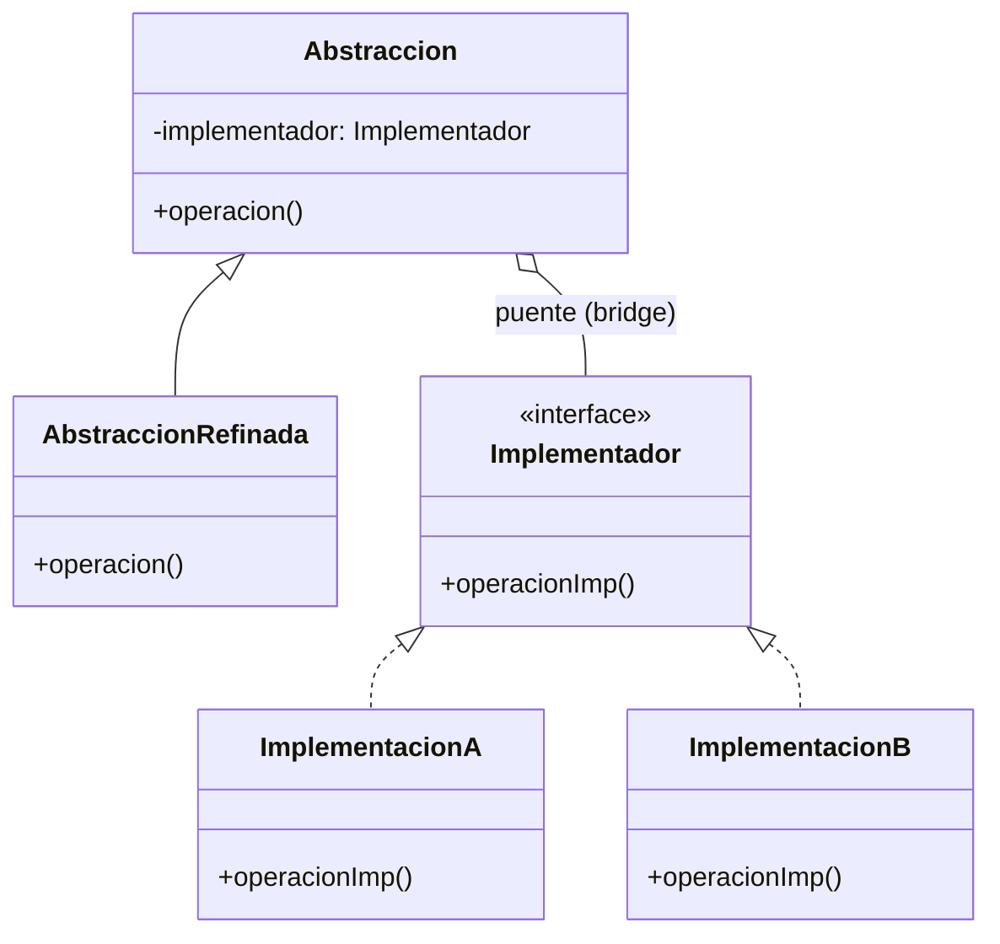

# Bridge (Puente)

## ¿Qué es?
El **Bridge** es un patrón de diseño **estructural** que permite dividir una clase grande, o un conjunto de clases estrechamente relacionadas, en dos jerarquías separadas (abstracción e implementación) que pueden desarrollarse independientemente.

Arquitectónicamente, el Bridge sustituye la herencia por la **composición**. En lugar de intentar hacer todo en una sola jerarquía de clases, delegamos una de las dimensiones del problema a un objeto separado.

## Problema que intenta resolver
El problema principal es la **explosión de clases** por crecimiento combinatorio. 
Imagina que tienes una clase `Forma` con subclases `Circulo` y `Cuadrado`. Ahora quieres añadir colores: `Rojo` y `Azul`. Si usas herencia, terminarías con: `CirculoRojo`, `CirculoAzul`, `CuadradoRojo`, `CuadradoAzul`. 
Si añades una forma más y un color más, el número de clases crece exponencialmente.

## Situación sin patrón
Uso de herencia para extender el sistema en múltiples dimensiones:

```java
// Diseño ingenuo: Explosión de clases
class Forma {}
class Circulo extends Forma {}
class Cuadrado extends Forma {}

// Para añadir colores, nos vemos obligados a crear:
class CirculoRojo extends Circulo {}
class CirculoAzul extends Circulo {}
class CuadradoRojo extends Cuadrado {}
class CuadradoAzul extends Cuadrado {}
```

### Problemas del diseño ingenuo:
1. **Rigidez:** Cualquier cambio en la lógica de colores afecta a todas las formas.
2. **Mantenibilidad:** El número de clases se vuelve inmanejable.
3. **Acoplamiento Fuerte:** La forma y el color están fundidos en una sola jerarquía.

## Idea principal del patrón
La filosofía es **separar la Abstracción de la Implementación**. 
- La **Abstracción** es la capa de alto nivel (el "qué": ej. una Forma).
- La **Implementación** es la capa de bajo nivel (el "cómo": ej. cómo se pinta un Color).

En lugar de que `Circulo` sea `Rojo` por herencia, `Circulo` **tiene** un objeto de tipo `Color`.

## Cómo funciona
1. **Abstracción:** Define la interfaz de control y mantiene una referencia a un objeto de tipo Implementación.
2. **Abstracción Refinada:** Extiende la interfaz definida por la Abstracción (ej. `Circulo`).
3. **Implementación (Interfaz):** Define la interfaz para todas las clases de implementación.
4. **Implementaciones Concretas:** Código específico para cada plataforma o variante (ej. `Rojo`, `Azul`).

## UML del patrón

### UML Mermaid


## Implementación esencial en Java

```java
// 1. Implementación (Interfaz)
interface Color {
    void aplicarColor();
}

// 2. Implementaciones Concretas
class Rojo implements Color {
    public void aplicarColor() { System.out.println("Aplicando color ROJO"); }
}

class Azul implements Color {
    public void aplicarColor() { System.out.println("Aplicando color AZUL"); }
}

// 3. Abstracción (Contiene el "Puente" hacia Color)
abstract class Forma {
    protected Color color; // El Puente

    protected Forma(Color color) {
        this.color = color;
    }

    abstract void dibujar();
}

// 4. Abstracciones Refinadas
class Circulo extends Forma {
    public Circulo(Color color) { super(color); }

    public void dibujar() {
        System.out.print("Dibujando Círculo... ");
        color.aplicarColor();
    }
}
```

## Relación con SOLID y POO
1. **Single Responsibility Principle (SRP):** Puedes concentrarte en la lógica de las formas en un lado y en la lógica de los colores en otro.
2. **Open/Closed Principle (OCP):** Puedes introducir nuevas formas y nuevos colores de forma independiente sin tocar el código existente.
3. **Composición sobre Herencia:** Es el ejemplo perfecto de por qué la composición es más flexible que la herencia rígida.

## Trade-offs (Ventajas y Desventajas)
- **Ventaja:** Permite que las dos dimensiones varíen independientemente. Oculta los detalles de implementación al cliente.
- **Desventaja:** Introduce complejidad adicional al dividir una jerarquía en dos. Puede ser difícil de entender para programadores junior.

## Cuándo usarlo y cuándo NO
- **Usar:** Cuando quieres evitar una explosión de clases por dimensiones ortogonales, o cuando necesitas compartir una implementación entre varios objetos de abstracción.
- **No usar:** Si tu jerarquía solo crece en una dirección o si la complejidad adicional no justifica el beneficio (diseño excesivo).
