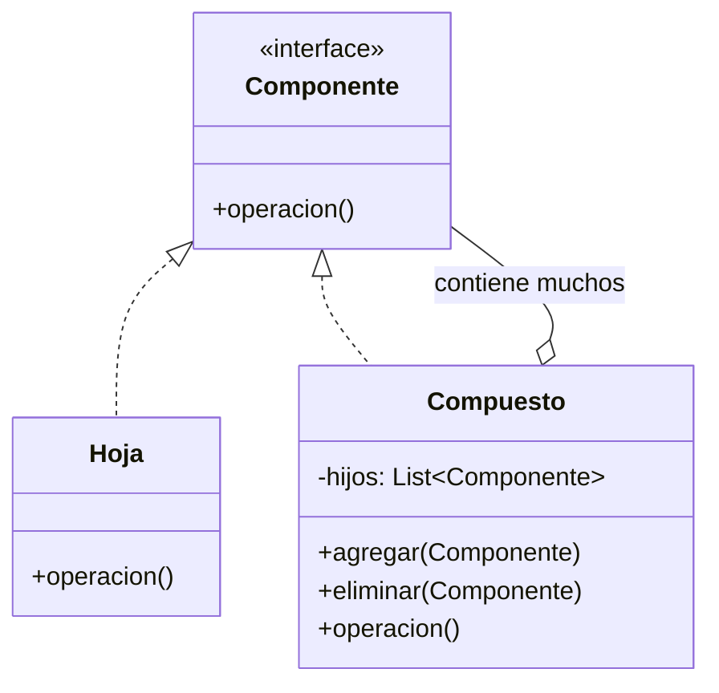

# Composite (Objeto Compuesto)

## ¿Qué es?
El **Composite** es un patrón de diseño **estructural** que permite componer objetos en estructuras de árbol para representar jerarquías de parte-todo. 

Arquitectónicamente, este patrón permite que los clientes traten de manera uniforme a los objetos individuales (hojas) y a las composiciones de objetos (contenedores/ramas).

## Problema que intenta resolver
El problema surge cuando tienes una jerarquía de objetos y quieres realizar una operación sobre toda la estructura, pero el código cliente se vuelve complejo porque tiene que distinguir si está tratando con un objeto simple o con un contenedor que tiene hijos. 
Esta distinción genera muchos condicionales (`if/else`) y hace que el código sea difícil de mantener y extender.

## Situación sin patrón
Imagina un sistema de archivos con archivos y carpetas. Si quieres calcular el tamaño total, el cliente tiene que preguntar qué es cada cosa:

```java
// Diseño ingenuo: El cliente debe diferenciar tipos
public class Cliente {
    public void calcularPrecio(Object item) {
        if (item instanceof Producto) {
            System.out.println(((Producto) item).getPrecio());
        } else if (item instanceof Caja) {
            Caja caja = (Caja) item;
            // Iterar sobre el contenido de la caja...
        }
    }
}
```

### Problemas del diseño ingenuo:
1. **Acoplamiento Fuerte:** El cliente conoce todas las clases concretas de la jerarquía.
2. **Violación del OCP:** Cada vez que añadas un nuevo tipo de contenedor, debes modificar el código del cliente.
3. **Complejidad Recursiva Manual:** El cliente es responsable de gestionar la recursividad.

## Idea principal del patrón
La filosofía es **utilizar una interfaz común para objetos simples y compuestos**.
Un objeto compuesto (contenedor) implementa la misma interfaz que sus elementos. Cuando se le pide realizar una operación, el compuesto delega el trabajo a sus hijos, procesa los resultados y los devuelve al cliente, quien no sabe (ni le importa) si el resultado vino de un solo objeto o de una estructura compleja.

## Cómo funciona
1. **Componente (Interfaz):** Describe las operaciones comunes tanto para los elementos simples como para los complejos.
2. **Hoja (Leaf):** Objeto simple que no tiene hijos. Implementa las operaciones del componente.
3. **Compuesto (Composite):** Objeto complejo que contiene hijos (hojas u otros compuestos). Implementa los métodos del componente delegando el trabajo a sus hijos.

## UML del patrón

### UML Mermaid


## Implementación esencial en Java

```java
// 1. Componente
interface Item {
    double getPrecio();
}

// 2. Hoja (Leaf)
class Producto implements Item {
    private double precio;
    public Producto(double precio) { this.precio = precio; }
    
    public double getPrecio() { return this.precio; }
}

// 3. Compuesto (Composite)
class Caja implements Item {
    private List<Item> contenido = new ArrayList<>();

    public void agregar(Item item) { contenido.add(item); }

    public double getPrecio() {
        double total = 0;
        for (Item item : contenido) {
            total += item.getPrecio(); // Delegación recursiva
        }
        return total;
    }
}
```

## Relación con SOLID y POO
1. **Open/Closed Principle (OCP):** Puedes introducir nuevos tipos de elementos u hojas sin romper el código cliente existente.
2. **Polimorfismo:** Es la clave del patrón. El cliente trata a todos los elementos como `Item`, aprovechando el enlace dinámico.
3. **Recursividad:** El patrón facilita estructuras recursivas naturales.

## Trade-offs (Ventajas y Desventajas)
- **Ventaja:** Simplifica el código del cliente al tratar estructuras complejas como objetos individuales. Facilita la creación de jerarquías tipo árbol.
- **Desventaja:** Puede ser difícil restringir los tipos de componentes que pueden entrar en un compuesto (ej. evitar que una caja contenga solo ciertos productos) sin romper la interfaz común.

## Cuándo usarlo y cuándo NO
- **Usar:** Cuando necesites representar jerarquías de parte-todo (ej. menús, sistemas de archivos, estructuras de UI, organigramas).
- **No usar:** Si tu jerarquía no tiene un comportamiento común o si la estructura es plana y no justifica la sobrecarga de la interfaz compuesta.
