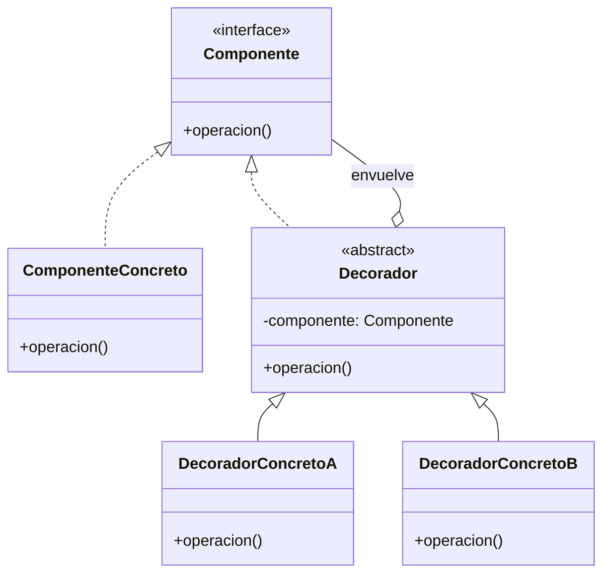

# Decorator (Decorador / Envoltorio)

## ¿Qué es?
El **Decorator** es un patrón de diseño **estructural** que permite añadir funcionalidades a un objeto de forma dinámica sin modificar su estructura original ni recurrir a la herencia.

Arquitectónicamente, se basa en la **composición** y el **encadenamiento de objetos**. Un decorador tiene la misma interfaz que el objeto que envuelve, lo que permite apilar múltiples decoradores uno encima de otro para combinar comportamientos.

## Problema que intenta resolver
El problema principal es la **rigidez de la herencia**. Cuando queremos añadir pequeñas variaciones de comportamiento a una clase, la herencia nos obliga a crear una subclase para cada combinación posible, lo que lleva a una explosión de clases inmanejable. 
Además, la herencia es **estática**: no puedes añadir o quitar una funcionalidad a un objeto una vez que ha sido creado.

## Situación sin patrón
Imagina una cafetería. Tienes un `Cafe` básico y quieres añadirle `Leche`, `Azúcar` o `Chocolate`.

```java
// Diseño ingenuo: Explosión por herencia
class Cafe {}
class CafeConLeche extends Cafe {}
class CafeConAzucar extends Cafe {}
class CafeConLecheYAzucar extends CafeConLeche {}
class CafeConChocolateLecheYAzucar extends CafeConLecheYAzucar {}
```

### Problemas del diseño ingenuo:
1. **Explosión de clases:** El número de clases crece exponencialmente con cada nuevo ingrediente.
2. **Inflexibilidad:** Si el cliente decide quitar el azúcar a mitad de la preparación, no puedes "des-heredar" dinámicamente.
3. **Código duplicado:** La lógica de calcular el precio se repite o se vuelve muy compleja en cada subclase.

## Idea principal del patrón
La filosofía es **"Envolver el objeto"**. 
En lugar de crear una clase `CafeConLeche`, creamos un objeto `Cafe` y lo metemos dentro de un objeto `LecheDecorador`. 
Como el decorador se comporta como un café (implementa la misma interfaz), el cliente no nota la diferencia, pero el decorador añade su propia lógica (ej. suma su precio) antes o después de delegar la llamada al café interno.

## Cómo funciona
1. **Componente (Interfaz):** Define la interfaz común para el objeto original y sus decoradores.
2. **Componente Concreto:** El objeto básico al que se le añadirán responsabilidades.
3. **Decorador (Clase Base):** Mantiene una referencia al objeto envuelto y sigue la misma interfaz que el componente.
4. **Decoradores Concretos:** Implementan los comportamientos adicionales.

## UML del patrón

### UML Mermaid


## Implementación esencial en Java

```java
// 1. Componente
interface Bebida {
    String getDescripcion();
    double costo();
}

// 2. Componente Concreto
class CafeSimple implements Bebida {
    public String getDescripcion() { return "Café Simple"; }
    public double costo() { return 10.0; }
}

// 3. Decorador (Clase Base)
abstract class AgregadoDecorator implements Bebida {
    protected Bebida bebida; // El objeto envuelto

    public AgregadoDecorator(Bebida bebida) { this.bebida = bebida; }
}

// 4. Decorador Concreto
class ConLeche extends AgregadoDecorator {
    public ConLeche(Bebida b) { super(b); }

    public String getDescripcion() { return bebida.getDescripcion() + ", con Leche"; }
    public double costo() { return bebida.costo() + 2.0; }
}
```

## Relación con SOLID y POO
1. **Open/Closed Principle (OCP):** Puedes añadir nuevas funcionalidades (nuevos decoradores) sin modificar la clase original ni los decoradores existentes.
2. **Single Responsibility Principle (SRP):** En lugar de tener una clase "Dios" que haga todo, divides las responsabilidades en pequeñas clases decoradoras.
3. **Composición sobre Herencia:** Es el uso más elegante de la composición para extender comportamiento en tiempo de ejecución.

## Trade-offs (Ventajas y Desventajas)
- **Ventaja:** Mucho más flexible que la herencia. Permite combinar comportamientos de forma infinita en tiempo de ejecución.
- **Desventaja:** Genera muchos objetos pequeños (el sistema puede ser difícil de depurar si hay demasiadas capas de "envoltorios"). La identidad del objeto cambia (el decorador no es exactamente el mismo objeto original).

## Cuándo usarlo y cuándo NO
- **Usar:** Cuando necesitas añadir responsabilidades a objetos individuales de forma dinámica y transparente, o cuando la herencia es inviable debido a una explosión de subclases.
- **No usar:** Si la jerarquía de decoradores se vuelve tan profunda que es difícil de rastrear, o si necesitas depender de la clase concreta del objeto original (ya que el decorador oculta el tipo real).
