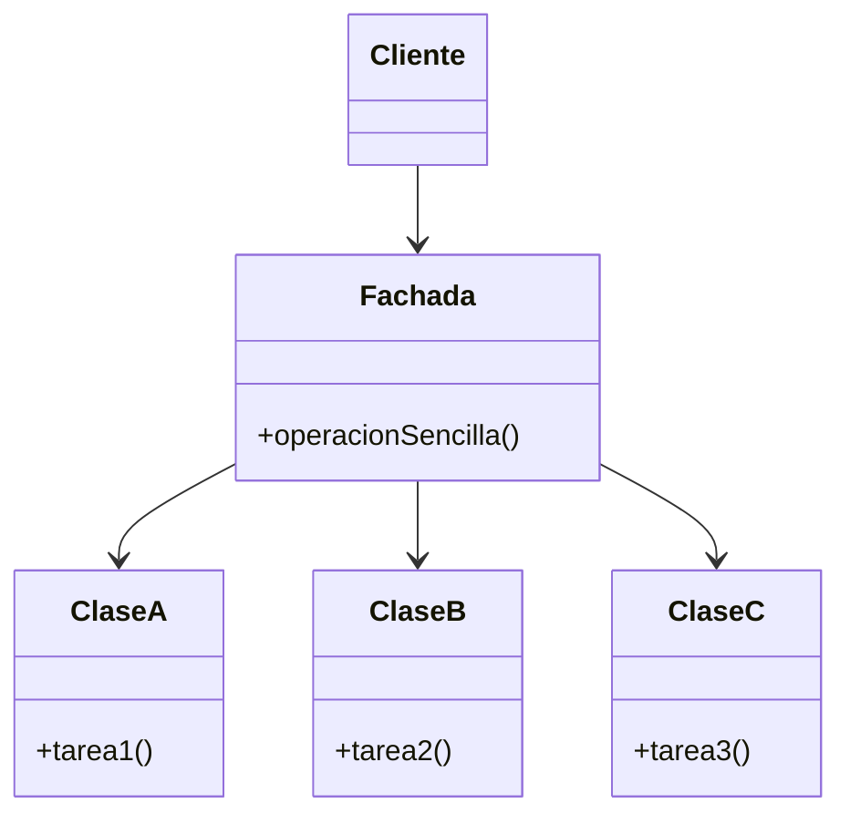

# Facade (Fachada)

## ¿Qué es?
El **Facade** es un patrón de diseño **estructural** que proporciona una interfaz simplificada a un conjunto complejo de clases, una biblioteca o un framework.

Arquitectónicamente, la Fachada actúa como un **punto de entrada único** a un subsistema. No oculta las clases del subsistema al 100% (si el cliente necesita poder acceder a la complejidad, puede hacerlo), pero ofrece una "cara amable" y sencilla para las tareas más comunes.

## Problema que intenta resolver
El problema principal es el **acoplamiento excesivo** y la **complejidad de uso**. 
Cuando un sistema crece, se divide en muchos subsistemas y clases especializadas. Para que un cliente realice una tarea simple, a veces tiene que instanciar 10 clases diferentes, configurar sus estados y llamar a sus métodos en un orden estricto. Esto hace que el código del cliente sea difícil de entender, probar y mantener.

## Situación sin patrón
Imagina un sistema de conversión de video. El cliente tiene que lidiar con el lector de archivos, el codec, el bitstream, el mezclador de audio, etc.

```java
// Diseño ingenuo: El cliente debe conocer toda la complejidad
public class Cliente {
    public void convertirVideo(String archivo) {
        VideoFile file = new VideoFile(archivo);
        Codec sourceCodec = CodecFactory.extract(file);
        BitrateReader reader = new BitrateReader();
        VideoBuffer buffer = reader.read(file, sourceCodec);
        AudioMixer mixer = new AudioMixer();
        // ... 20 líneas más de configuración compleja
        System.out.println("Video convertido");
    }
}
```

### Problemas del diseño ingenuo:
1. **Acoplamiento Fuerte:** El cliente depende de muchísimas clases internas del subsistema. Si el subsistema cambia, el cliente se rompe.
2. **Dificultad de Uso:** El cliente debe ser un "experto" en el subsistema para poder usarlo.
3. **Violación del Encapsulamiento:** Los detalles de implementación del subsistema se filtran hacia afuera.

## Idea principal del patrón
La filosofía es **"Ofrecer una interfaz simple para una tarea compleja"**. 
Creamos una clase `Fachada` que conoce qué componentes del subsistema invocar y en qué orden. El cliente solo le dice a la Fachada: "Haz X", y la Fachada se encarga de toda la "fontanería" interna.

## Cómo funciona
1. **Fachada:** Proporciona acceso a una parte específica de la funcionalidad del subsistema. Sabe a qué clases delegar cada petición.
2. **Subsistema Complejo:** Conjunto de clases que realizan tareas especializadas. No conocen la existencia de la Fachada.
3. **Cliente:** Utiliza la Fachada en lugar de llamar directamente a los objetos del subsistema.

## UML del patrón

### UML Mermaid


## Implementación esencial en Java

```java
// Subsistema Complejo (Clases ocultas tras la fachada)
class CPU { void encender() { System.out.println("CPU lista"); } }
class Memoria { void cargar() { System.out.println("Cargando datos..."); } }
class DiscoDuro { void leerDatos() { System.out.println("Leyendo sectores..."); } }

// 1. La Fachada
class ComputadoraFacade {
    private CPU cpu;
    private Memoria memoria;
    private DiscoDuro disco;

    public ComputadoraFacade() {
        this.cpu = new CPU();
        this.memoria = new Memoria();
        this.disco = new DiscoDuro();
    }

    // Operación simplificada para el cliente
    public void arrancar() {
        System.out.println("Iniciando arranque rápido...");
        cpu.encender();
        memoria.cargar();
        disco.leerDatos();
        System.out.println("Computadora lista para usar");
    }
}

// 2. El Cliente
class Usuario {
    public static void main(String[] args) {
        ComputadoraFacade pc = new ComputadoraFacade();
        pc.arrancar(); // El usuario no sabe nada de CPU o Disco
    }
}
```

## Relación con SOLID y POO
1. **Principio de Inversión de Dependencias (DIP):** El cliente depende de una interfaz más estable (la Fachada) en lugar de depender de múltiples clases volátiles del subsistema.
2. **Single Responsibility Principle (SRP):** La Fachada se encarga únicamente de orquestar el subsistema, dejando que las clases internas se encarguen de sus tareas específicas.
3. **Encapsulamiento:** Protegemos la integridad del subsistema al ofrecer un canal de acceso controlado.

## Trade-offs (Ventajas y Desventajas)
- **Ventaja:** Reduce drásticamente el acoplamiento y simplifica el uso de sistemas complejos.
- **Desventaja:** Existe el riesgo de que la Fachada se convierta en un **Objeto Dios** (una clase que sabe y hace demasiado) si intentamos meter toda la funcionalidad del subsistema en ella.

## Cuándo usarlo y cuándo NO
- **Usar:** Cuando quieras proporcionar una interfaz simple a un subsistema complejo o cuando quieras estructurar un subsistema en capas.
- **No usar:** Si el cliente ya necesita toda la potencia y flexibilidad del subsistema original (la fachada solo le estorbaría) o si el subsistema es lo suficientemente simple como para ser usado directamente.
