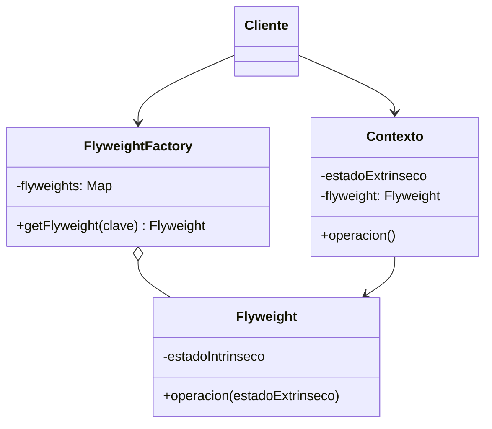

# Flyweight (Peso Ligero)

## ¿Qué es?
El **Flyweight** es un patrón de diseño **estructural** que permite ajustar más objetos en la cantidad disponible de memoria compartiendo partes comunes del estado entre varios objetos en lugar de mantener todos los datos en cada objeto.

Arquitectónicamente, el Flyweight se basa en la distinción entre el **estado intrínseco** (datos que son iguales para muchos objetos y no cambian) y el **estado extrínseco** (datos que son únicos para cada objeto y cambian según el contexto).

## Problema que intenta resolver
El problema principal es el **consumo excesivo de memoria RAM** cuando una aplicación necesita crear una cantidad masiva de objetos similares (miles o millones). Si cada objeto guarda toda su información de forma independiente, el sistema puede quedarse sin memoria rápidamente, incluso si la mayoría de esos datos son idénticos entre los objetos.

## Situación sin patrón
Imagina un videojuego de guerra con 10,000 partículas de proyectiles. Cada proyectil guarda sus coordenadas, velocidad, pero también su modelo 3D y texturas pesadas.

```java
// Diseño ingenuo: Cada objeto es pesado e independiente
class Proyectil {
    private double x, y; // Estado extrínseco (único)
    private byte[] modelo3D; // Estado intrínseco (compartido, ¡muy pesado!)
    private byte[] textura;  // Estado intrínseco (compartido, ¡muy pesado!)

    public Proyectil(double x, double y, byte[] modelo, byte[] tex) {
        this.x = x;
        this.y = y;
        this.modelo3D = modelo;
        this.textura = tex;
    }
}
```

### Problemas del diseño ingenuo:
1. **Desperdicio de Memoria:** Tenemos 10,000 copias idénticas del mismo modelo 3D y textura en la RAM.
2. **Inescalabilidad:** Si queremos subir a 100,000 proyectiles, la aplicación crasheará por falta de memoria.
3. **Poca Eficiencia:** El recolector de basura (GC) tendrá que gestionar miles de objetos pesados innecesariamente.

## Idea principal del patrón
La filosofía es **"Compartir lo que es común"**. 
Extraemos los datos pesados y constantes (intrínsecos) a un objeto único llamado **Flyweight**. Los miles de objetos individuales (contextos) ahora solo guardan sus datos variables (extrínsecos) y una referencia al objeto Flyweight compartido.

## Cómo funciona
1. **Flyweight:** Contiene el estado intrínseco (ej. el dibujo de un árbol, el modelo de una bala).
2. **Contexto:** Contiene el estado extrínseco (ej. la posición X, Y de ese árbol específico).
3. **Flyweight Factory:** Gestiona la creación y el reciclaje de los objetos Flyweight. Si pides un Flyweight que ya existe, te devuelve el mismo en lugar de crear uno nuevo.
4. **Cliente:** Calcula o almacena el estado extrínseco y lo pasa al Flyweight cuando necesita que este realice una acción.

## UML del patrón

### UML Mermaid


## Implementación esencial en Java

```java
// 1. El Flyweight (Estado Intrínseco)
class TipoProyectil {
    private String nombre;
    private String color;
    private String textura; // Datos pesados

    public TipoProyectil(String nombre, String color, String textura) {
        this.nombre = nombre;
        this.color = color;
        this.textura = textura;
    }

    public void dibujar(double x, double y) {
        System.out.println("Dibujando " + nombre + " en (" + x + "," + y + ")");
    }
}

// 2. La Fabrica (Gestión de compartición)
class ProyectilFactory {
    private static Map<String, TipoProyectil> tipos = new HashMap<>();

    public static TipoProyectil getTipo(String nombre, String color, String textura) {
        String clave = nombre + color;
        if (!tipos.containsKey(clave)) {
            tipos.put(clave, new TipoProyectil(nombre, color, textura));
        }
        return tipos.get(clave);
    }
}

// 3. El Contexto (Estado Extrínseco)
class Proyectil {
    private double x, y;
    private TipoProyectil tipo; // Referencia al Flyweight

    public Proyectil(double x, double y, TipoProyectil tipo) {
        this.x = x;
        this.y = y;
        this.tipo = tipo;
    }

    public void mostrar() {
        tipo.dibujar(x, y);
    }
}
```

## Relación con SOLID y POO
1. **Inmutabilidad:** Los objetos Flyweight deben ser **inmutables**. Como son compartidos por muchos contextos, si uno cambiara el estado intrínseco, afectaría a todos los demás accidentalmente.
2. **Encapsulamiento:** El patrón oculta la complejidad de la gestión de memoria tras una fábrica.
3. **Responsabilidad Única (SRP):** La fábrica se encarga de la gestión de instancias, mientras que el Flyweight se encarga de la representación.

## Trade-offs (Ventajas y Desventajas)
- **Ventaja:** Ahorro masivo de memoria RAM. Permite manejar millones de objetos en sistemas con recursos limitados.
- **Desventaja:** **Costo de CPU**. Ahora hay que buscar el Flyweight en el mapa cada vez que se necesita, y hay que pasar los parámetros extrínsecos en cada llamada, lo que puede aumentar ligeramente el tiempo de procesamiento.

## Cuándo usarlo y cuándo NO
- **Usar:** Cuando la aplicación necesita una cantidad ingente de objetos que agotan la memoria y puedes identificar claramente una parte de sus datos que es común y repetitiva.
- **No usar:** Si no tienes problemas de memoria (no añadas complejidad innecesaria) o si los objetos no comparten realmente ningún estado significativo.
