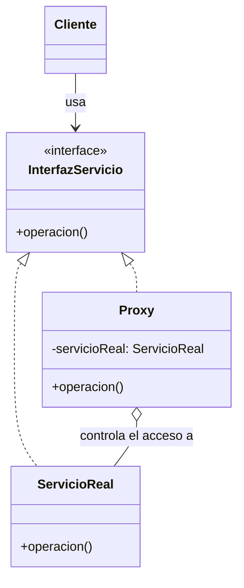

# Proxy (Procurador / Sustituto)

## ¿Qué es?
El **Proxy** es un patrón de diseño **estructural** que proporciona un sustituto o marcador de posición para otro objeto. Un proxy controla el acceso al objeto original, permitiendo realizar algo antes o después de que la solicitud llegue al objeto real.

Arquitectónicamente, el Proxy actúa como un **intermediario**. El cliente cree que está interactuando con el objeto real, pero en realidad está hablando con un "representante" que gestiona la comunicación con el objeto final.

## Problema que intenta resolver
Existen situaciones donde interactuar directamente con un objeto no es eficiente o seguro:
1. **Costo de creación:** El objeto es muy "pesado" (consume mucha memoria o tiempo) y no queremos crearlo hasta que sea estrictamente necesario (**Virtual Proxy**).
2. **Control de acceso:** Queremos verificar permisos antes de permitir una operación (**Protection Proxy**).
3. **Recursos remotos:** El objeto vive en otro servidor o espacio de memoria (**Remote Proxy**).
4. **Auditoría:** Necesitamos registrar (log) cada vez que se accede a un objeto sin modificar su clase original.

## Situación sin patrón
Imagina un sistema que carga imágenes de alta resolución desde un disco. Si cargamos todas las imágenes al iniciar la aplicación, la memoria se agotaría.

```java
// Diseño ingenuo: Carga pesada inmediata
class ImagenReal {
    public ImagenReal(String archivo) {
        System.out.println("Cargando " + archivo + " desde disco... (Costoso)");
    }
    public void mostrar() {
        System.out.println("Mostrando imagen en pantalla");
    }
}

// El cliente carga todo, incluso si no lo muestra
public class Cliente {
    public static void main(String[] args) {
        ImagenReal img = new ImagenReal("foto_pesada.jpg"); // Paga el costo ahora
        // Pasa el tiempo...
        img.mostrar();
    }
}
```

### Problemas del diseño ingenuo:
1. **Desperdicio de recursos:** Cargamos objetos que quizás nunca se usen.
2. **Falta de control:** No hay una capa intermedia para añadir lógica de seguridad o logging de forma limpia.
3. **Latencia:** El cliente debe esperar a que el objeto pesado se cree completamente antes de poder seguir.

## Idea principal del patrón
La filosofía es **"No hables con el objeto real si no es necesario"**. 
Creamos una clase Proxy que tiene la misma interfaz que el objeto real. El Proxy contiene una referencia al objeto real (que inicialmente es `null`). Cuando el cliente llama a un método, el Proxy decide qué hacer:
- Si el objeto real aún no existe, lo crea (**Lazy Initialization**).
- Si el cliente no tiene permisos, lanza una excepción.
- Si todo está bien, delega la llamada al objeto real.

## Cómo funciona
1. **Interfaz de Servicio:** Define las operaciones comunes para el objeto real y el proxy.
2. **Servicio Real:** La clase que realiza la lógica de negocio pesada o sensible.
3. **Proxy:** Mantiene una referencia al objeto real. Implementa la misma interfaz de servicio para poder sustituir al objeto real de forma transparente.

## UML del patrón

### UML Mermaid


## Implementación esencial en Java

```java
// 1. Interfaz común
interface Imagen {
    void mostrar();
}

// 2. Objeto Real (Pesado)
class ImagenReal implements Imagen {
    private String nombreArchivo;

    public ImagenReal(String nombreArchivo) {
        this.nombreArchivo = nombreArchivo;
        cargarDesdeDisco(); // Operación costosa
    }

    private void cargarDesdeDisco() {
        System.out.println("Cargando " + nombreArchivo + "...");
    }

    public void mostrar() {
        System.out.println("Mostrando " + nombreArchivo);
    }
}

// 3. El Proxy (Ligero)
class ImagenProxy implements Imagen {
    private ImagenReal imagenReal;
    private String nombreArchivo;

    public ImagenProxy(String nombreArchivo) {
        this.nombreArchivo = nombreArchivo;
    }

    public void mostrar() {
        // Carga perezosa (Lazy Load)
        if (imagenReal == null) {
            imagenReal = new ImagenReal(nombreArchivo);
        }
        imagenReal.mostrar();
    }
}
```

## Relación con SOLID y POO
1. **Open/Closed Principle (OCP):** Puedes introducir nuevos proxys (para logging, seguridad, caché) sin cambiar el código del servicio real ni del cliente.
2. **Single Responsibility Principle (SRP):** El servicio real se enfoca en su lógica de negocio, mientras que el Proxy se encarga de las responsabilidades secundarias (acceso, carga, red).
3. **Encapsulamiento:** El proxy oculta la complejidad de la gestión del ciclo de vida del objeto real.

## Trade-offs (Ventajas y Desventajas)
- **Ventaja:** Permite optimizar el rendimiento (carga perezosa) y añadir capas de seguridad/auditoría de forma transparente. El cliente no nota la diferencia.
- **Desventaja:** Introduce una capa de indirección que puede añadir una pequeña latencia. El código puede volverse más complejo debido a la introducción de nuevas interfaces y clases sustitutas.

## Cuándo usarlo y cuándo NO
- **Usar:** Cuando necesites controlar el acceso a un objeto costoso, remoto o sensible, o cuando quieras añadir funcionalidades extra (como caché) sin modificar la clase original.
- **No usar:** Si no tienes problemas de rendimiento ni de seguridad, ya que el Proxy añade una complejidad estructural que podría ser innecesaria.
