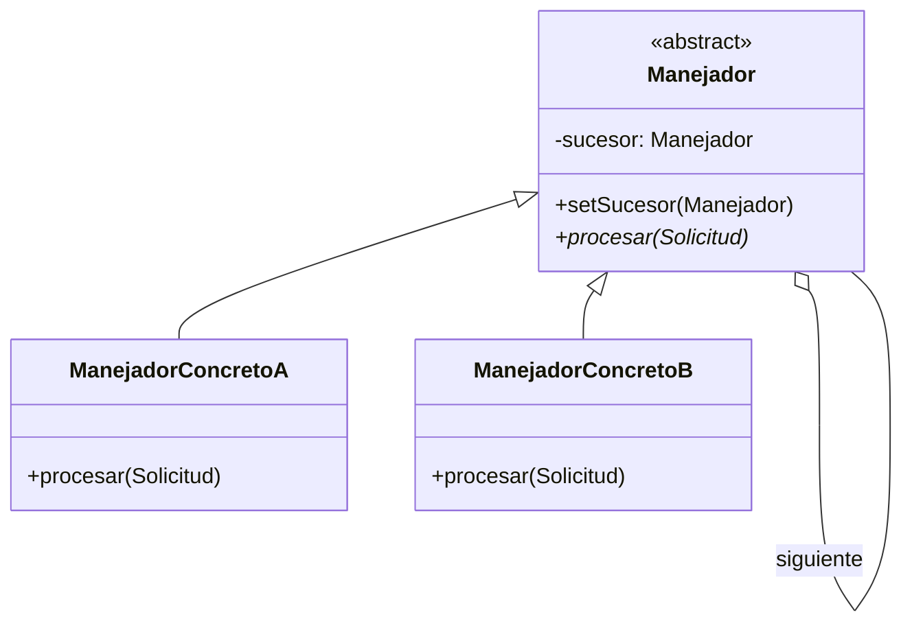

# Chain of Responsibility (Cadena de Responsabilidad)

## ¿Qué es?
El **Chain of Responsibility** es un patrón de diseño **de comportamiento** que permite pasar solicitudes a lo largo de una cadena de manejadores. Al recibir una solicitud, cada manejador decide si la procesa o si la pasa al siguiente manejador de la cadena.

Arquitectónicamente, este patrón desacopla al emisor de una solicitud de sus receptores, dando a más de un objeto la oportunidad de manejar la solicitud de forma secuencial.

## Problema que intenta resolver
El problema surge cuando un sistema tiene múltiples tipos de solicitudes y cada una requiere un procesamiento diferente, pero no queremos que el emisor de la solicitud tenga que saber qué objeto específico debe procesarla. 
Sin este patrón, terminaríamos con una estructura de control gigante (`if/else` o `switch`) que conoce a todos los posibles manejadores, lo que genera un acoplamiento fuerte y viola la extensibilidad.

## Situación sin patrón
Imagina un sistema de soporte técnico con tres niveles de atención. El cliente (emisor) tiene que saber a quién llamar según la complejidad:

```java
// Diseño ingenuo: El emisor decide quién maneja la lógica
public class Soporte {
    public void procesarTicket(Ticket ticket) {
        if (ticket.getPrioridad() == 1) {
            new Nivel1().resolver(ticket);
        } else if (ticket.getPrioridad() == 2) {
            new Nivel2().resolver(ticket);
        } else {
            new Nivel3().resolver(ticket);
        }
    }
}
```

### Problemas del diseño ingenuo:
1. **Acoplamiento Fuerte:** La clase `Soporte` conoce todas las implementaciones de niveles.
2. **Violación del OCP:** Si añadimos un "Nivel Especialista", debemos modificar la lógica de decisión central.
3. **Rigidez:** El orden de procesamiento está "quemado" en el código y no se puede cambiar dinámicamente.

## Idea principal del patrón
La filosofía es **"Encadenar los manejadores y pasar la solicitud"**. 
Cada manejador tiene una referencia al "siguiente" en la cadena. Si un manejador no puede resolver la petición, simplemente se la pasa al siguiente. El emisor solo lanza la petición al primer eslabón de la cadena, sin preocuparse de quién terminará resolviéndola.

## Cómo funciona
1. **Manejador (Interfaz/Clase Abstracta):** Declara la interfaz para todos los manejadores concretos y, opcionalmente, implementa el enlace al siguiente manejador.
2. **Manejador Concreto:** Contiene la lógica real para procesar la solicitud. Si puede manejarla, lo hace; si no, la pasa al sucesor.
3. **Cliente:** Configura la cadena y lanza la solicitud al primer manejador.

## UML del patrón

### UML Mermaid


## Implementación esencial en Java

```java
// 1. Clase base para el Manejador
abstract class ManejadorTickets {
    protected ManejadorTickets siguiente;

    public void setSiguiente(ManejadorTickets siguiente) {
        this.siguiente = siguiente;
    }

    public abstract void manejarTicket(int prioridad);
}

// 2. Manejadores Concretos
class SoporteNivel1 extends ManejadorTickets {
    public void manejarTicket(int prioridad) {
        if (prioridad <= 1) {
            System.out.println("Nivel 1: Ticket resuelto.");
        } else if (siguiente != null) {
            siguiente.manejarTicket(prioridad);
        }
    }
}

class SoporteNivel2 extends ManejadorTickets {
    public void manejarTicket(int prioridad) {
        if (prioridad <= 2) {
            System.out.println("Nivel 2: Ticket resuelto.");
        } else if (siguiente != null) {
            siguiente.manejarTicket(prioridad);
        }
    }
}

// 3. Uso en el Cliente
public class Main {
    public static void main(String[] args) {
        ManejadorTickets nivel1 = new SoporteNivel1();
        ManejadorTickets nivel2 = new SoporteNivel2();
        
        // Configuramos la cadena
        nivel1.setSiguiente(nivel2);

        // Lanzamos peticiones al primer eslabón
        nivel1.manejarTicket(1); // Resuelve nivel 1
        nivel1.manejarTicket(2); // Pasa al nivel 2 y resuelve
    }
}
```

## Relación con SOLID y POO
1. **Single Responsibility Principle (SRP):** Cada clase manejadora se encarga de un solo tipo de procesamiento.
2. **Open/Closed Principle (OCP):** Puedes introducir nuevos manejadores en la cadena sin cambiar el código existente de los otros manejadores o del emisor.
3. **Encapsulamiento:** El cliente no sabe cómo se procesa la solicitud internamente ni cuántos pasos atraviesa.

## Trade-offs (Ventajas y Desventajas)
- **Ventaja:** Reduce el acoplamiento. Permite cambiar dinámicamente el orden y las responsabilidades de la cadena.
- **Desventaja:** **No hay garantía de recepción**. Si ningún manejador procesa la solicitud, esta puede "caerse" al final de la cadena sin ser atendida. Además, puede ser difícil de depurar si la cadena es muy larga.

## Cuándo usarlo y cuándo NO
- **Usar:** Cuando el sistema necesita procesar distintos tipos de solicitudes de forma secuencial pero el conjunto de manejadores y su orden deben ser dinámicos. Ejemplos: Middlewares web, filtros de seguridad, validadores de formularios.
- **No usar:** Si solo hay un manejador posible o si el proceso de decisión es extremadamente simple, ya que el patrón introduce una sobrecarga estructural importante.
