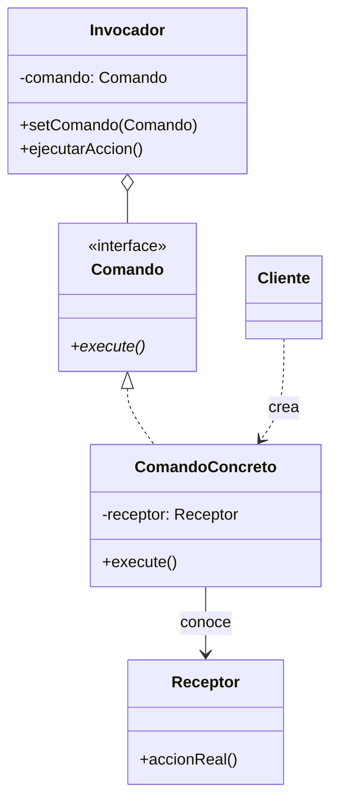

# Command (Comando)

## ¿Qué es?
El **Command** es un patrón de diseño **de comportamiento** que convierte una solicitud en un objeto independiente que contiene toda la información sobre la solicitud. 

Arquitectónicamente, esta transformación permite parametrizar métodos con diferentes solicitudes, retrasar o poner en cola la ejecución de una solicitud y soportar operaciones que se pueden deshacer (undo).

## Problema que intenta resolver
El problema surge cuando el objeto que **emite** una orden (ej. un botón en una interfaz) está demasiado acoplado al objeto que **ejecuta** la acción (ej. un motor o una base de datos). 
Si el botón llama directamente a un método del motor, el botón se vuelve inútil para cualquier otra tarea. Además, si queremos añadir funcionalidades como un historial de acciones, macros o un sistema de "Deshacer", es imposible hacerlo si las llamadas son directas y rígidas.

## Situación sin patrón
Imagina un control remoto donde cada botón está programado para hablar directamente con una luz específica:

```java
// Diseño ingenuo: El emisor conoce al receptor y la acción exacta
class BotonControl {
    private Luz luz;
    
    public BotonControl(Luz luz) { this.luz = luz; }

    public void presionar() {
        luz.encender(); // Acoplamiento directo
    }
}
```

### Problemas del diseño ingenuo:
1. **Falta de Reutilización:** El `BotonControl` solo sirve para luces. Si queremos un botón para abrir una puerta, tenemos que crear otra clase.
2. **Imposibilidad de Historial:** No hay forma de guardar una lista de las acciones ejecutadas para deshacerlas después.
3. **Rigidez:** La acción está "quemada" en el código del emisor.

## Idea principal del patrón
La filosofía es **"Encapsular la acción en un objeto Comando"**. 
Creamos un objeto intermedio (el Comando) que actúa como un sobre con una carta dentro. El emisor (el Botón) solo sabe que tiene un "sobre" y que puede decir "¡Ejecútate!". El emisor no sabe qué dice la carta ni quién la va a leer; solo entrega el mensaje.

## Cómo funciona
1. **Comando (Interfaz):** Declara el método `execute()`.
2. **Comando Concreto:** Define el enlace entre un Receptor y una acción. Implementa `execute()` llamando a los métodos del Receptor.
3. **Receptor:** El objeto que sabe cómo realizar el trabajo real (el motor, la luz, el documento).
4. **Invocador (Invoker):** El objeto que solicita al comando que realice la acción (el botón, el control remoto).
5. **Cliente:** Crea los comandos concretos y los asigna al invocador.

## UML del patrón

### UML Mermaid


## Implementación esencial en Java

```java
// 1. Interfaz Comando
interface Command {
    void execute();
}

// 2. Receptor (El que hace el trabajo)
class Luz {
    public void encender() { System.out.println("Luz encendida"); }
    public void apagar() { System.out.println("Luz apagada"); }
}

// 3. Comandos Concretos
class EncenderLuzCommand implements Command {
    private Luz luz;
    public EncenderLuzCommand(Luz luz) { this.luz = luz; }
    
    public void execute() { luz.encender(); }
}

// 4. Invocador (El que lanza la orden)
class ControlRemoto {
    private Command slot;

    public void setCommand(Command command) { this.slot = command; }
    
    public void presionarBoton() {
        slot.execute();
    }
}
```

## Relación con SOLID y POO
1. **Single Responsibility Principle (SRP):** Desacoplas las clases que invocan operaciones de las clases que las realizan.
2. **Open/Closed Principle (OCP):** Puedes introducir nuevos comandos sin romper el código existente de los invocadores o receptores.
3. **Composición:** El invocador no hereda comportamientos, los recibe a través de objetos comando.

## Trade-offs (Ventajas y Desventajas)
- **Ventaja:** Permite crear sistemas de "Undo/Redo", colas de tareas, registro de logs de acciones y macros (comandos que ejecutan otros comandos).
- **Desventaja:** Introduce una gran cantidad de clases nuevas, lo que puede complicar el diseño si no se necesitan realmente sus beneficios (como el deshacer).

## Cuándo usarlo y cuándo NO
- **Usar:** Cuando necesites parametrizar objetos con acciones, poner tareas en cola, ejecutarlas de forma remota o soportar operaciones de "deshacer".
- **No usar:** Si el emisor y el receptor ya están en la misma capa y la relación es simple, ya que el patrón añade una capa de indirección considerable.
