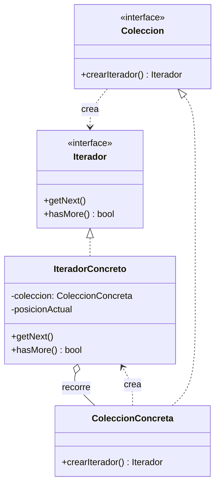

# Iterator (Iterador)

## ¿Qué es?
El **Iterator** es un patrón de diseño **de comportamiento** que permite recorrer los elementos de una colección sin exponer su representación subyacente (lista, pila, árbol, etc.).

Arquitectónicamente, el Iterator extrae el comportamiento de recorrido de una colección a un objeto separado. Esto permite que diferentes algoritmos de recorrido puedan coexistir y que la colección se mantenga limpia de lógica de navegación.

## Problema que intenta resolver
El problema principal es el **acoplamiento entre la lógica de negocio y la estructura de datos**.
Imagina que tienes una colección compleja, como un Grafo o un Árbol. Para recorrer sus elementos, el cliente necesita conocer los detalles internos: si debe usar recursividad, si debe seguir punteros, si hay una lista enlazada, etc. 

Si el cliente conoce estas entrañas:
1. **Rompe el encapsulamiento:** La colección ya no puede cambiar su estructura interna sin romper a todos sus clientes.
2. **Duplicación de código:** Si varios clientes necesitan recorrer la colección de la misma forma, todos deben implementar la misma lógica compleja de bucles.
3. **Inflexibilidad:** Es difícil cambiar el orden del recorrido (ej. de profundidad a anchura) sin reescribir el código cliente.

## Situación sin patrón
El cliente accede directamente a la estructura interna para recorrerla:

```java
// Diseño ingenuo: El cliente conoce la estructura (Lista enlazada)
class MiColeccion {
    public Nodo primerNodo;
}

class Cliente {
    public void imprimir(MiColeccion col) {
        Nodo actual = col.primerNodo;
        while (actual != null) {
            System.out.println(actual.valor);
            actual = actual.siguiente; // El cliente sabe que es una lista
        }
    }
}
```

### Problemas del diseño ingenuo:
1. **Dependencia Estructural:** Si mañana cambiamos la lista por un Árbol Binario, el método `imprimir` del cliente deja de funcionar.
2. **Responsabilidades Mezcladas:** La colección debería solo guardar datos, no enseñar al mundo cómo caminar sobre ellos.

## Idea principal del patrón
La filosofía es **"Externalizar el recorrido"**. 
La colección delega la responsabilidad de la navegación a un objeto especial llamado **Iterador**. El cliente ya no le pregunta a la colección "dame tus nodos", sino que le pide un iterador: "dame algo que sepa cómo caminar sobre ti". El cliente solo usa métodos genéricos como `siguiente()` y `hasMore()`.

## Cómo funciona
1. **Iterador (Interfaz):** Define las operaciones para recorrer la colección (ej. `getNext()`, `hasMore()`).
2. **Iterador Concreto:** Implementa el algoritmo de recorrido específico para una colección concreta. Mantiene el rastro del progreso (la posición actual).
3. **Colección (Interfaz):** Declara un método para obtener iteradores compatibles con ella.
4. **Colección Concreta:** Devuelve instancias de iteradores concretos configurados para su estructura.

## UML del patrón

### UML Mermaid


## Implementación esencial en Java

```java
// 1. Interfaz Iterador
interface Iterator<T> {
    boolean hasNext();
    T next();
}

// 2. Interfaz Colección
interface IterableCollection<T> {
    Iterator<T> createIterator();
}

// 3. Implementación Concreta
class ListaNombres implements IterableCollection<String> {
    private String[] nombres = {"Juan", "Maria", "Pedro"};

    public Iterator<String> createIterator() {
        return new NombreIterator(this.nombres);
    }
}

class NombreIterator implements Iterator<String> {
    private String[] nombres;
    private int posicion = 0;

    public NombreIterator(String[] nombres) { this.nombres = nombres; }

    public boolean hasNext() { return posicion < nombres.length; }
    public String next() { return nombres[posicion++]; }
}
```

## Relación con SOLID y POO
1. **Single Responsibility Principle (SRP):** Limpias la colección y el código cliente de algoritmos de recorrido complejos.
2. **Open/Closed Principle (OCP):** Puedes implementar nuevos tipos de colecciones y nuevos tipos de iteradores (ej. recorrido inverso) sin romper el código existente.
3. **Abstracción:** El cliente trata con una interfaz `Iterator`, ignorando si el origen es una base de datos, un array o un árbol.

## Trade-offs (Ventajas y Desventajas)
- **Ventaja:** Permite recorrer colecciones de forma uniforme. Facilita el recorrido paralelo (varios iteradores al mismo tiempo sobre la misma colección).
- **Desventaja:** Puede ser un diseño excesivo para colecciones muy simples. En algunos lenguajes (como Python), ya existen mecanismos nativos tan potentes que implementar el patrón manualmente es redundante.

## Cuándo usarlo y cuándo NO
- **Usar:** Cuando tu colección tenga una estructura compleja y quieras ocultar esa complejidad al cliente, o cuando necesites múltiples formas de recorrer la misma estructura.
- **No usar:** Si trabajas con estructuras de datos simples y lineales donde un bucle `for` estándar es suficiente y más legible.
