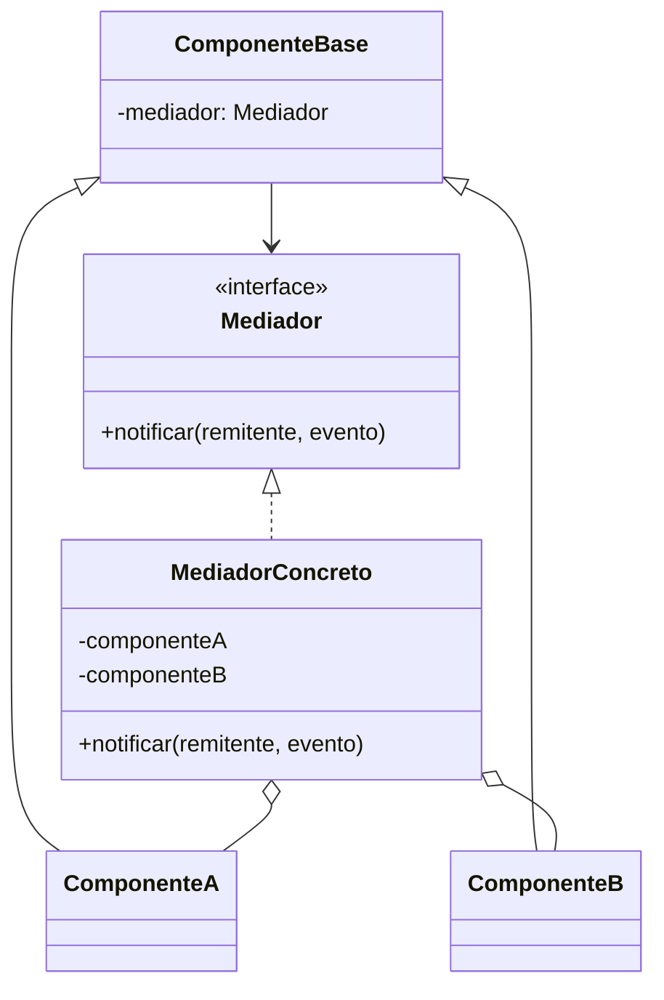

# Mediator (Mediador)

## ¿Qué es?
El **Mediator** es un patrón de diseño **de comportamiento** que permite reducir las dependencias caóticas entre objetos. El patrón restringe las comunicaciones directas entre los objetos y los obliga a colaborar únicamente a través de un objeto mediador.

Arquitectónicamente, el Mediator actúa como un **concentrador de comunicaciones**. En lugar de que cientos de objetos se conozcan entre sí, todos conocen a un único Mediador, simplificando drásticamente la red de relaciones del sistema.

## Problema que intenta resolver
El problema principal es el **acoplamiento en red (Spaghetti Code)**. 
Imagina una interfaz de usuario compleja con muchos botones, campos de texto y listas. Cuando el usuario marca un "checkbox", se debe habilitar un botón, limpiar un campo de texto y filtrar una lista. 

Si cada componente conoce a los demás para avisarles de los cambios:
1. **Acoplamiento Exponencial:** Cada nuevo componente debe conocer a todos los existentes.
2. **Dificultad de Reutilización:** Los componentes no pueden usarse en otras pantallas porque están "pegados" a sus vecinos.
3. **Mantenimiento Imposible:** Seguir el flujo de una acción se vuelve un laberinto de llamadas cruzadas.

## Situación sin patrón
Objetos comunicándose directamente entre sí:

```java
// Diseño ingenuo: Componentes acoplados
class BotonEnviar {
    private CampoTexto campo;
    private ListaUsuarios lista;

    public void click() {
        if (!campo.getText().isEmpty()) {
            lista.actualizar();
        }
    }
}
```

### Problemas del diseño ingenuo:
1. **Dependencias Cruzadas:** El botón tiene que conocer la existencia y los métodos del campo y de la lista.
2. **Fragilidad:** Si cambias la lista por un grid, tienes que modificar el botón.

## Idea principal del patrón
La filosofía es **"Centralizar la comunicación"**. 
Los objetos (colegas) dejan de hablarse entre ellos. Cuando algo ocurre en un objeto, este simplemente le avisa al Mediador: "Oye, me han presionado". El Mediador, que tiene la visión global del sistema, decide qué otros objetos deben reaccionar. Los objetos se vuelven "ciegos" respecto a sus compañeros, pero mucho más independientes y reutilizables.

## Cómo funciona
1. **Mediador (Interfaz):** Declara los métodos de comunicación (usualmente uno solo llamado `notify`).
2. **Mediador Concreto:** Coordina la colaboración entre los componentes. Tiene referencias a todos ellos.
3. **Colegas (Componentes):** Clases que realizan la lógica de negocio. No conocen a otros colegas, solo conocen al Mediador.

## UML del patrón

### UML Mermaid


## Implementación esencial en Java

```java
// 1. Interfaz Mediador
interface Mediador {
    void notificar(Componente remitente, String evento);
}

// 2. Clase base para los componentes (Colegas)
abstract class Componente {
    protected Mediador mediador;
    public Componente(Mediador m) { this.mediador = m; }
}

// 3. Componentes Concretos
class Boton extends Componente {
    public Boton(Mediador m) { super(m); }
    public void presionar() { mediador.notificar(this, "click"); }
}

class CampoTexto extends Componente {
    public CampoTexto(Mediador m) { super(m); }
    public void habilitar() { System.out.println("Campo habilitado"); }
}

// 4. Mediador Concreto (El cerebro)
class FormularioMediador implements Mediador {
    private Boton boton;
    private CampoTexto campo;

    public void setBoton(Boton b) { this.boton = b; }
    public void setCampo(CampoTexto c) { this.campo = c; }

    public void notificar(Componente remitente, String evento) {
        if (remitente == boton && evento.equals("click")) {
            campo.habilitar(); // El mediador decide la lógica de reacción
        }
    }
}
```

## Relación con SOLID y POO
1. **Single Responsibility Principle (SRP):** Extraes la lógica de comunicación entre múltiples objetos a un solo lugar.
2. **Open/Closed Principle (OCP):** Puedes introducir nuevos mediadores sin cambiar los componentes individuales.
3. **Ley de Demeter:** Los componentes solo "hablan con su amigo inmediato" (el mediador) en lugar de hablar con extraños.

## Trade-offs (Ventajas y Desventajas)
- **Ventaja:** Elimina el acoplamiento directo. Facilita la reutilización de componentes individuales. Centraliza el control del flujo de la aplicación.
- **Desventaja:** **Riesgo de Objeto Dios**. El Mediador puede volverse extremadamente complejo y difícil de mantener si intenta gestionar demasiadas interacciones.

## Cuándo usarlo y cuándo NO
- **Usar:** En sistemas de interfaces de usuario (GUIs), sistemas de control de tráfico (aéreo, trenes) o cualquier escenario donde un grupo de objetos deba cooperar pero sus relaciones sean demasiado complejas.
- **No usar:** Si los objetos son pocos y sus interacciones son sencillas; aplicar un Mediador aquí solo añadiría una capa de complejidad innecesaria.
