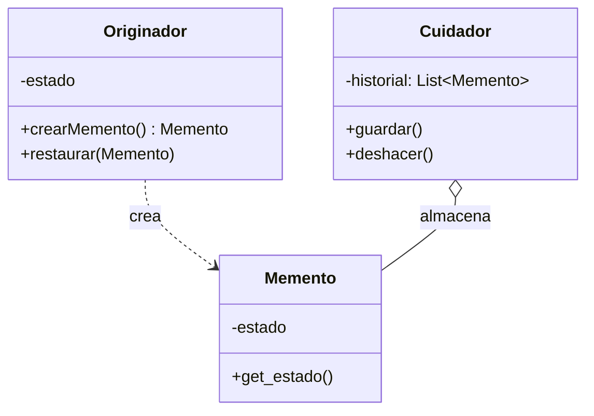

# Memento (Recuerdo)

## ¿Qué es?
El **Memento** es un patrón de diseño **de comportamiento** que permite capturar y externalizar el estado interno de un objeto sin violar su encapsulamiento, de forma que el objeto pueda ser restaurado a este estado más tarde.

Arquitectónicamente, el Memento proporciona una forma de implementar "puntos de control" (checkpoints) o mecanismos de "deshacer" (undo), delegando la responsabilidad de guardar el estado a un objeto especial que solo el creador original puede leer.

## Problema que intenta resolver
El problema principal es la **violación del encapsulamiento al intentar guardar el estado de un objeto**. 
Imagina un editor de texto con muchos atributos internos (texto, fuente, color, posición del cursor). Si queremos implementar un "deshacer", necesitamos guardar una copia de estos datos. 

Si el código encargado de guardar el estado (el cliente) accede directamente a los atributos del editor, obligamos a que esos atributos sean públicos. Esto expone los detalles internos del objeto y rompe el principio de ocultación de datos. Si la estructura interna del editor cambia, el sistema de guardado también se rompe.

## Situación sin patrón
El cliente gestiona manualmente el estado interno del objeto:

```java
// Diseño ingenuo: El cliente conoce la estructura interna
class Editor {
    public String texto; // Debe ser público para que el cliente lo guarde
    public int cursorX, cursorY;
}

class Historial {
    private List<String> estados = new ArrayList<>();
    
    public void guardar(Editor e) {
        estados.add(e.texto); // El historial sabe demasiado del Editor
    }
}
```

### Problemas del diseño ingenuo:
1. **Acoplamiento Fuerte:** El historial depende de los campos específicos del editor.
2. **Violación de Encapsulamiento:** El editor se ve obligado a exponer sus entrañas.
3. **Mantenimiento Difícil:** Si el editor añade una nueva propiedad (ej. negrita), hay que modificar el historial.

## Idea principal del patrón
La filosofía es **"El objeto es el único que sabe cómo guardarse y restaurarse"**. 
En lugar de que un objeto externo "le robe" los datos al objeto principal, el objeto principal crea un pequeño objeto opaco llamado **Memento**. Este Memento contiene una copia del estado. El mundo exterior (Caretaker) puede guardar el Memento, pero **no puede leer su contenido**. Solo el creador original (Originator) puede abrir el Memento para restaurar su estado.

## Cómo funciona
1. **Originador (Originator):** La clase principal que tiene el estado. Crea el Memento y lo usa para restaurarse.
2. **Memento:** Objeto inmutable que guarda el estado del Originador. Actúa como una "caja negra" para los demás.
3. **Cuidador (Caretaker):** Se encarga de guardar y entregar los Mementos, pero nunca los modifica ni accede a sus datos internos.

## UML del patrón

### UML Mermaid


## Implementación esencial en Java

```java
// 1. El Recuerdo (Inmutable)
class Memento {
    private final String estado;
    public Memento(String estado) { this.estado = estado; }
    public String getEstado() { return estado; }
}

// 2. El Originador
class Editor {
    private String contenido;

    public void escribir(String texto) { this.contenido = texto; }
    
    // Crea el memento
    public Memento guardar() {
        return new Memento(contenido);
    }

    // Restaura desde un memento
    public void restaurar(Memento m) {
        this.contenido = m.getEstado();
    }
}

// 3. El Cuidador (Caretaker)
class Historial {
    private Stack<Memento> mementos = new Stack<>();

    public void backup(Memento m) { mementos.push(m); }
    public Memento undo() { return mementos.pop(); }
}
```

## Relación con SOLID y POO
1. **Encapsulamiento:** Es el núcleo del patrón. El estado interno permanece privado y solo es accesible por el originador.
2. **Single Responsibility Principle (SRP):** El Cuidador se encarga del historial, y el Originador de la lógica de negocio y de su propio estado.
3. **Inmutabilidad:** Los Mementos deben ser inmutables para garantizar que el estado guardado no sea alterado accidentalmente.

## Trade-offs (Ventajas y Desventajas)
- **Ventaja:** Permite volver a estados anteriores de forma segura y limpia. Mantiene el encapsulamiento intacto.
- **Desventaja:** **Consumo de memoria**. Si el estado es muy pesado y se guardan muchos mementos, la memoria puede agotarse rápidamente.

## Cuándo usarlo y cuándo NO
- **Usar:** Cuando necesites implementar sistemas de "deshacer", snapshots de juegos o transacciones que deban poder revertirse ante un error.
- **No usar:** Si el objeto tiene un estado muy simple (un solo campo) o si el costo de copiar el estado es demasiado alto en términos de memoria/rendimiento.
