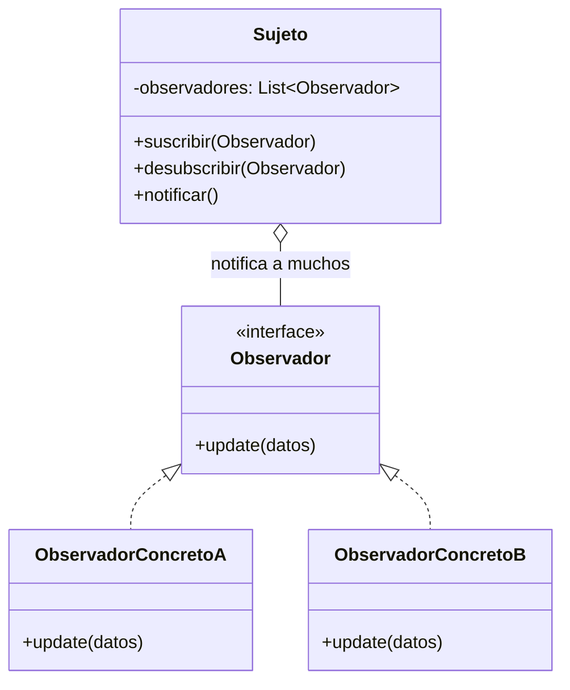

# Observer (Observador / Publicador-Suscriptor)

## ¿Qué es?
El **Observer** es un patrón de diseño **de comportamiento** que define una dependencia de uno a muchos entre objetos, de forma que cuando un objeto cambia su estado, todos sus dependientes son notificados y actualizados automáticamente.

Arquitectónicamente, es la base de la **programación dirigida por eventos**. Permite que un objeto (el Sujeto) emita avisos sin necesidad de conocer quiénes son sus receptores (los Observadores) ni qué harán con la información.

## Problema que intenta resolver
El problema principal es el **acoplamiento fuerte en la comunicación de cambios**. 
Imagina un sistema donde un componente de "Inventario" debe avisar al "Departamento de Compras", al "Dashboard de Ventas" y al "Sistema de Logística" cada vez que un producto se agota. 

Si el Inventario llama directamente a cada uno de estos sistemas, el código se vuelve rígido:
1. **Dependencia directa:** El Inventario debe conocer las clases de todos los interesados.
2. **Dificultad de extensión:** Cada vez que un nuevo departamento quiera ser avisado, hay que modificar la clase Inventario.
3. **Inconsistencia:** Si un sistema no está disponible o falla, puede bloquear la ejecución del Inventario.

## Situación sin patrón
Uso de llamadas directas y rígidas para notificar cambios:

```java
// Diseño ingenuo: El Sujeto conoce a todos sus observadores
public class Inventario {
    private Compras compras = new Compras();
    private Ventas ventas = new Ventas();

    public void productoAgotado(String nombre) {
        // Acoplamiento total
        compras.generarOrden(nombre);
        ventas.actualizarGrafico(nombre);
    }
}
```

### Problemas del diseño ingenuo:
1. **Violación del OCP:** Para dejar de avisar a "Ventas", hay que borrar código en "Inventario".
2. **Falta de flexibilidad:** No se pueden añadir suscriptores en tiempo de ejecución.
3. **Responsabilidad difusa:** El Inventario está gestionando lógica de otros departamentos.

## Idea principal del patrón
La filosofía es **"Invertir la responsabilidad de la notificación"**. 
En lugar de que el Sujeto sepa a quién avisar, él simplemente mantiene una **lista de interesados** (suscriptores). Los interesados son quienes se acercan al Sujeto y le dicen: "Por favor, añádeme a tu lista". Cuando ocurre algo importante, el Sujeto recorre su lista y envía un aviso genérico a todos.

## Cómo funciona
1. **Sujeto (Subject / Observable):** Mantiene una lista de observadores y proporciona métodos para añadir o eliminar observadores. Tiene un método `notificar()` que recorre la lista.
2. **Observador (Interfaz):** Define el método `update()` que el Sujeto llamará para notificar cambios.
3. **Observadores Concretos:** Implementan la interfaz y definen qué hacer cuando reciben la notificación.

## UML del patrón

### UML Mermaid


## Implementación esencial en Java

```java
// 1. Interfaz Observador
interface Suscriptor {
    void recibirNotificacion(String mensaje);
}

// 2. El Sujeto (Publicador)
class CanalNoticias {
    private List<Suscriptor> suscriptores = new ArrayList<>();

    public void suscribir(Suscriptor s) { suscriptores.add(s); }
    public void desubscribir(Suscriptor s) { suscriptores.remove(s); }

    public void publicarNoticia(String noticia) {
        System.out.println("Publicando: " + noticia);
        for (Suscriptor s : suscriptores) {
            s.recibirNotificacion(noticia); // Notificación genérica
        }
    }
}

// 3. Observadores Concretos
class AppMovil implements Suscriptor {
    public void recibirNotificacion(String m) {
        System.out.println("[App] Notificación Push: " + m);
    }
}

class SistemaEmail implements Suscriptor {
    public void recibirNotificacion(String m) {
        System.out.println("[Email] Enviando correo: " + m);
    }
}
```

## Relación con SOLID y POO
1. **Open/Closed Principle (OCP):** Puedes añadir nuevos tipos de observadores sin cambiar ni una línea de código del Sujeto.
2. **Bajo Acoplamiento:** El Sujeto solo conoce la interfaz `Observador`, no las clases concretas.
3. **Single Responsibility Principle (SRP):** El Sujeto solo se encarga de su estado y de notificar; la lógica de reacción vive en los observadores.

## Trade-offs (Ventajas y Desventajas)
- **Ventaja:** Comunicación extremadamente flexible y dinámica. Facilita la creación de sistemas reactivos.
- **Desventaja:** **Orden aleatorio**. No puedes garantizar en qué orden se notificarán los observadores. Además, si hay demasiados observadores o el proceso de actualización es lento, puede degradar el rendimiento del Sujeto (a menos que se use asincronía).

## Cuándo usarlo y cuándo NO
- **Usar:** En interfaces gráficas (GUI), sistemas de telemetría, blogs, redes sociales o cualquier sistema donde un cambio de estado deba propagarse a múltiples componentes desconocidos.
- **No usar:** Si la relación entre emisor y receptor es siempre 1 a 1 y nunca va a cambiar, ya que añade una capa de complejidad innecesaria.
