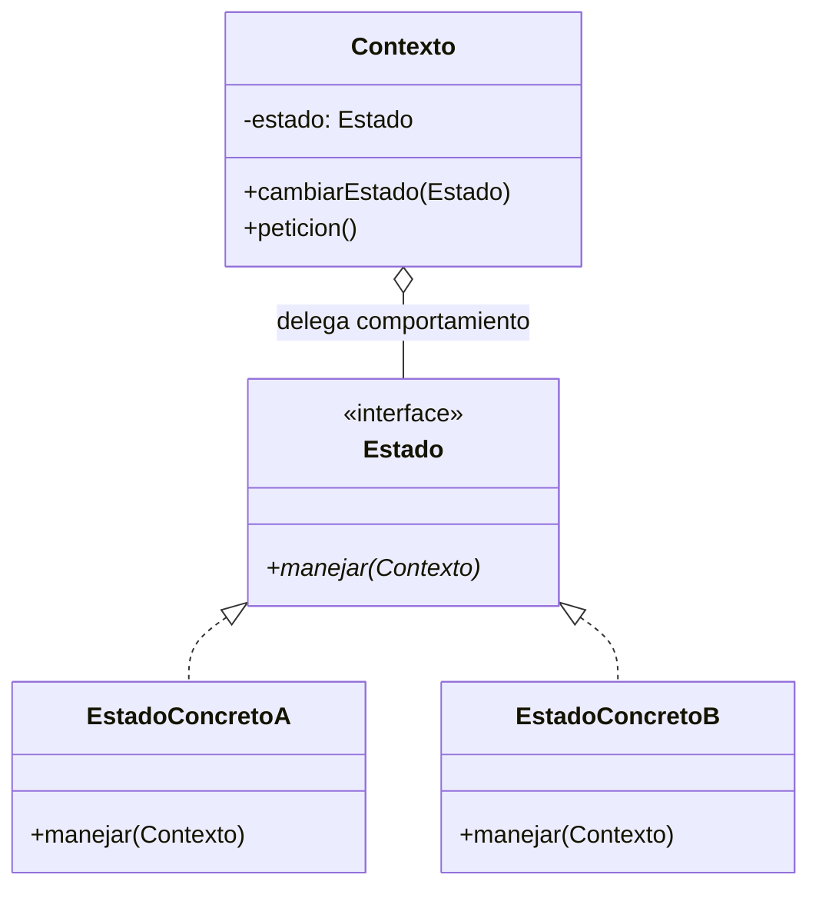

# State (Estado)

## ¿Qué es?
El **State** es un patrón de diseño **de comportamiento** que permite a un objeto alterar su comportamiento cuando su estado interno cambia. El objeto parecerá haber cambiado su clase.

Arquitectónicamente, el patrón State encapsula los comportamientos basados en estados en clases separadas y delega la responsabilidad del comportamiento actual al objeto que representa el estado presente.

## Problema que intenta resolver
El problema principal es la **complejidad de las máquinas de estado** gestionadas mediante condicionales gigantes. 
Cuando un objeto debe comportarse de forma radicalmente distinta según su estado actual (ej. un Reproductor de Música que hace cosas distintas si está en 'Pausa', 'Reproduciendo' o 'Detenido'), el código suele llenarse de bloques `if/else` o `switch` en cada uno de sus métodos. Esto hace que el código sea:
1. **Difícil de mantener:** Cualquier nuevo estado obliga a modificar todos los métodos de la clase principal.
2. **Propenso a errores:** Es fácil olvidar actualizar un condicional en alguno de los métodos, dejando al sistema en un estado inconsistente.

## Situación sin patrón
Imagina un Documento que puede estar en estados: `Borrador`, `Revisión` y `Publicado`.

```java
// Diseño ingenuo: Lógica de estados dispersa y condicional
public class Documento {
    private String estado = "BORRADOR";

    public void publicar() {
        if (estado.equals("BORRADOR")) {
            estado = "REVISION";
            System.out.println("Enviando a revisión...");
        } else if (estado.equals("REVISION")) {
            estado = "PUBLICADO";
            System.out.println("Documento publicado.");
        } else if (estado.equals("PUBLICADO")) {
            // No hace nada o lanza error
        }
    }

    public void editar() {
        if (estado.equals("PUBLICADO")) {
            estado = "BORRADOR"; // Vuelve a borrador si se edita
        }
        // ... más lógica
    }
}
```

### Problemas del diseño ingenuo:
1. **Violación del OCP:** Para añadir un estado "Archivado", hay que modificar todos los métodos de la clase `Documento`.
2. **Alta Complejidad Ciclomática:** Los métodos se vuelven difíciles de leer por la cantidad de ramas lógicas.
3. **Acoplamiento de Lógica:** La lógica de todos los estados está mezclada en una sola clase.

## Idea principal del patrón
La filosofía es **"Tratar a los estados como objetos de pleno derecho"**. 
En lugar de tener una variable `String estado`, tenemos un objeto de tipo `Estado`. La clase principal (el Contexto) simplemente delega todas las llamadas a este objeto. Cuando el estado cambia, el Contexto simplemente apunta a un objeto de estado diferente. Cada objeto de estado sabe exactamente qué hacer para su propia situación.

## Cómo funciona
1. **Contexto:** La clase que tiene el estado interno. Mantiene una referencia a una instancia de una subclase de Estado que define el estado actual.
2. **Estado (Interfaz):** Define una interfaz para encapsular el comportamiento asociado con un estado particular del Contexto.
3. **Estados Concretos:** Cada clase implementa el comportamiento real correspondiente a un estado del Contexto.

## UML del patrón

### UML Mermaid


## Implementación esencial en Java

```java
// 1. Interfaz Estado
interface EstadoPedido {
    void siguiente(Pedido pedido);
    void cancelar(Pedido pedido);
}

// 2. Estados Concretos
class EstadoNuevo implements EstadoPedido {
    public void siguiente(Pedido p) {
        p.setEstado(new EstadoEnviado());
        System.out.println("Pedido enviado.");
    }
    public void cancelar(Pedido p) {
        System.out.println("Pedido cancelado.");
    }
}

class EstadoEnviado implements EstadoPedido {
    public void siguiente(Pedido p) {
        System.out.println("El pedido ya llegó a su destino.");
    }
    public void cancelar(Pedido p) {
        System.out.println("Error: No se puede cancelar un pedido ya enviado.");
    }
}

// 3. El Contexto
class Pedido {
    private EstadoPedido estado = new EstadoNuevo(); // Estado inicial

    public void setEstado(EstadoPedido estado) { this.estado = estado; }

    public void avanzar() { estado.siguiente(this); }
    public void anular() { estado.cancelar(this); }
}
```

## Relación con SOLID y POO
1. **Single Responsibility Principle (SRP):** Organizas el código relacionado con estados particulares en clases separadas.
2. **Open/Closed Principle (OCP):** Introduces nuevos estados sin cambiar las clases de estado existentes ni el contexto.
3. **Polimorfismo:** El contexto se comporta de forma distinta simplemente cambiando el objeto al que delega, aprovechando el enlace dinámico.

## Trade-offs (Ventajas y Desventajas)
- **Ventaja:** Elimina condicionales masivos. Hace que las transiciones de estado sean explícitas.
- **Desventaja:** Puede ser un diseño excesivo si la máquina de estados es muy simple (2 o 3 estados que casi no cambian). Aumenta significativamente el número de clases.

## Cuándo usarlo y cuándo NO
- **Usar:** Cuando tienes un objeto cuyo comportamiento depende de su estado y el número de estados es considerable o la lógica de cada estado es compleja.
- **No usar:** Si el objeto solo tiene un par de estados muy sencillos y la lógica de transición es trivial; un simple `boolean` o un `enum` con un `if` será más limpio y rápido.
