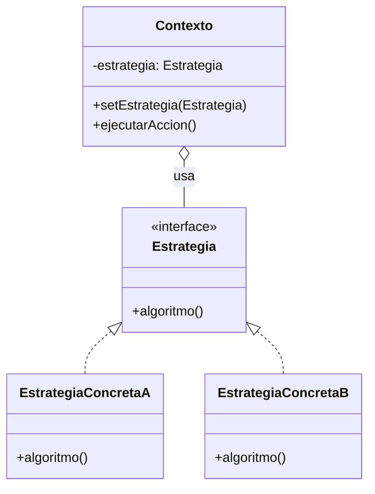

# Strategy (Estrategia)

## ¿Qué es?
El **Strategy** es un patrón de diseño **de comportamiento** que permite definir una familia de algoritmos, encapsular cada uno de ellos y hacerlos intercambiables. Este patrón permite que el algoritmo varíe independientemente de los clientes que lo utilizan.

Arquitectónicamente, el Strategy sustituye la herencia por la **composición** y la **delegación**, permitiendo cambiar el comportamiento de un objeto en tiempo de ejecución.

## Problema que intenta resolver
El problema surge cuando una clase tiene un comportamiento que puede realizarse de múltiples formas (algoritmos) y este comportamiento se selecciona mediante grandes bloques condicionales (`if/else` o `switch`). 
Esto genera varios problemas:
1. **Acoplamiento:** La clase principal conoce todos los detalles de todos los algoritmos.
2. **Dificultad de mantenimiento:** Cada vez que se añade o modifica un algoritmo, hay que tocar la clase principal.
3. **Inflexibilidad:** No se puede cambiar el algoritmo de un objeto una vez instanciado sin lógica compleja.

## Situación sin patrón
Imagina un procesador de pagos que soporta Tarjeta de Crédito y PayPal mediante condicionales:

```java
// Diseño ingenuo: Lógica de algoritmos mezclada y rígida
public class ProcesadorPagos {
    public void pagar(double monto, String metodo) {
        if (metodo.equals("tarjeta")) {
            System.out.println("Validando tarjeta...");
            System.out.println("Cobrando " + monto + " a la tarjeta.");
        } else if (metodo.equals("paypal")) {
            System.out.println("Redirigiendo a PayPal...");
            System.out.println("Cobrando " + monto + " vía PayPal.");
        }
    }
}
```

### Problemas del diseño ingenuo:
1. **Violación del OCP:** Para añadir "Criptomonedas", hay que modificar la clase `ProcesadorPagos`.
2. **Falta de cohesión:** La clase hace demasiadas cosas (conoce los detalles de cada pasarela de pago).
3. **Dificultad para testear:** Es difícil probar un solo método de pago de forma aislada.

## Idea principal del patrón
La filosofía es **"Extraer el algoritmo a un objeto separado"**. 
En lugar de que la clase principal implemente el algoritmo, esta mantiene una referencia a una interfaz `Estrategia`. En tiempo de ejecución, le inyectamos la implementación concreta que necesitemos. La clase principal (el Contexto) solo delega la ejecución al objeto estrategia.

## Cómo funciona
1. **Estrategia (Interfaz):** Define la interfaz común para todos los algoritmos soportados.
2. **Estrategias Concretas:** Implementan versiones específicas del algoritmo.
3. **Contexto:** Mantiene una referencia a una estrategia y se comunica con ella a través de la interfaz. No sabe qué estrategia concreta está usando.

## UML del patrón

### UML Mermaid


## Implementación esencial en Java

```java
// 1. Interfaz Estrategia
interface MetodoPago {
    void procesarPago(double monto);
}

// 2. Estrategias Concretas
class PagoTarjeta implements MetodoPago {
    public void procesarPago(double monto) {
        System.out.println("Pagando " + monto + " con Tarjeta.");
    }
}

class PagoPayPal implements MetodoPago {
    public void procesarPago(double monto) {
        System.out.println("Pagando " + monto + " con PayPal.");
    }
}

// 3. Contexto
class CarritoCompras {
    private MetodoPago metodo;

    public void setMetodoPago(MetodoPago metodo) {
        this.metodo = metodo;
    }

    public void realizarCompra(double total) {
        metodo.procesarPago(total); // Delegación
    }
}
```

## Relación con SOLID y POO
1. **Open/Closed Principle (OCP):** Puedes añadir nuevas estrategias sin modificar el contexto.
2. **Dependency Inversion Principle (DIP):** El contexto depende de una abstracción (`MetodoPago`), no de implementaciones concretas.
3. **Encapsulamiento:** Los detalles de cada algoritmo están ocultos dentro de sus propias clases.

## Trade-offs (Ventajas y Desventajas)
- **Ventaja:** Elimina condicionales complejos. Permite cambiar algoritmos en tiempo de ejecución. Facilita las pruebas unitarias de cada algoritmo por separado.
- **Desventaja:** Aumenta el número de clases. El cliente debe conocer las diferentes estrategias para elegir la adecuada (aunque esto se puede mitigar con el patrón Factory).

## Cuándo usarlo y cuándo NO
- **Usar:** Cuando tienes muchas clases relacionadas que solo difieren en su comportamiento, o cuando necesitas diferentes variantes de un algoritmo y quieres evitar los condicionales.
- **No usar:** Si el comportamiento rara vez cambia o si solo tienes uno o dos algoritmos muy simples, ya que la sobrecarga de interfaces y clases adicionales no compensaría el beneficio.
