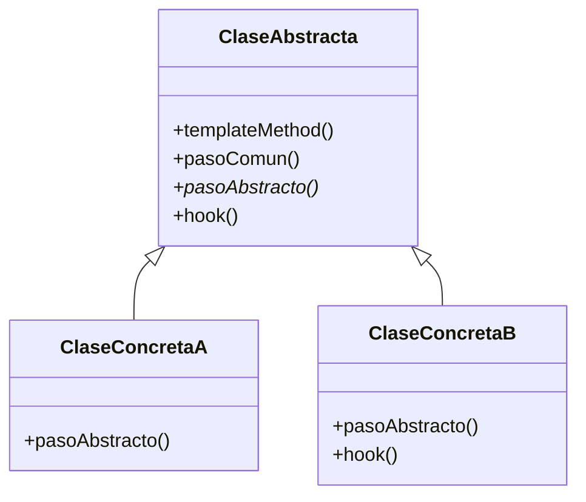

# Template Method (Método Plantilla)

## ¿Qué es?
El **Template Method** es un patrón de diseño **de comportamiento** que define el esqueleto de un algoritmo en una operación, delegando algunos pasos a las subclases. Permite que las subclases redefinan ciertos pasos de un algoritmo sin cambiar su estructura general.

Arquitectónicamente, se basa en la herencia para lograr la reutilización de código, estableciendo una serie de pasos fijos pero permitiendo "huecos" (ganchos o hooks) para que las subclases rellenen con lógica específica.

## Problema que intenta resolver
El problema principal es la **duplicación de código en algoritmos similares**. 
Imagina que tienes varios procesos que siguen exactamente los mismos pasos pero difieren solo en un detalle mínimo. Por ejemplo, procesar diferentes tipos de archivos (CSV, JSON, XML): todos deben abrirse, leerse, parsearse y cerrarse. 

Sin este patrón, terminarías con varias clases que tienen un 90% de código idéntico, lo que dificulta el mantenimiento: si el paso de "abrir archivo" cambia, tienes que corregirlo en todas las clases.

## Situación sin patrón
Varios procesos con pasos casi idénticos pero implementados por separado:

```java
// Diseño ingenuo: Código duplicado en procesos paralelos
class ProcesadorDataCSV {
    public void procesar() {
        System.out.println("Abriendo archivo...");
        System.out.println("Extrayendo datos de CSV...");
        System.out.println("Analizando datos...");
        System.out.println("Cerrando archivo...");
    }
}

class ProcesadorDataJSON {
    public void procesar() {
        System.out.println("Abriendo archivo...");
        System.out.println("Extrayendo datos de JSON...");
        System.out.println("Analizando datos...");
        System.out.println("Cerrando archivo...");
    }
}
```

### Problemas del diseño ingenuo:
1. **Redundancia:** La lógica de apertura, análisis y cierre se repite.
2. **Inconsistencia:** Es fácil que un programador olvide el paso de "cerrar archivo" en una nueva implementación.
3. **Mantenimiento pesado:** Cualquier cambio en la estructura global del algoritmo requiere modificar múltiples clases.

## Idea principal del patrón
La filosofía se conoce como el **Principio de Hollywood**: *"No nos llames, nosotros te llamaremos"*. 
La clase base (Padre) tiene el control total del flujo del algoritmo. Ella decide cuándo se abre el archivo y cuándo se cierra. Las clases hijas (Hijos) solo implementan los detalles específicos (ej. cómo parsear) cuando el padre decide invocarlos.

## Cómo funciona
1. **Clase Abstracta:** Declara los pasos del algoritmo como métodos abstractos y define el **Template Method** (normalmente un método `final` en Java) que invoca estos pasos en un orden específico.
2. **Pasos Concretos:** Implementaciones comunes en la clase base (ej. abrir archivo).
3. **Pasos Abstractos:** "Ganchos" que las subclases DEBEN implementar.
4. **Hooks (Opcionales):** Métodos con una implementación vacía por defecto que las subclases PUEDEN sobrescribir opcionalmente.

## UML del patrón

### UML Mermaid


## Implementación esencial en Java

```java
// 1. La clase base con el esqueleto
abstract class MineradorDeDatos {
    // El Método Plantilla (Template Method)
    public final void procesarArchivo() {
        abrirArchivo();
        extraerDatos(); // Paso abstracto
        analizarDatos();
        if (quieroReporte()) { // Hook
            generarReporte();
        }
        cerrarArchivo();
    }

    private void abrirArchivo() { System.out.println("Abriendo..."); }
    private void analizarDatos() { System.out.println("Analizando..."); }
    private void cerrarArchivo() { System.out.println("Cerrando..."); }

    protected abstract void extraerDatos();
    
    // Hook: implementación por defecto
    protected boolean quieroReporte() { return true; }
    private void generarReporte() { System.out.println("Reporte generado."); }
}

// 2. Subclase específica
class MineradorCSV extends MineradorDeDatos {
    @Override
    protected void extraerDatos() {
        System.out.println("Leyendo filas y columnas de CSV...");
    }
}
```

## Relación con SOLID y POO
1. **Open/Closed Principle (OCP):** Puedes crear nuevas variantes del algoritmo (nuevas subclases) sin modificar el esqueleto en la clase base.
2. **Don't Repeat Yourself (DRY):** Centralizas la lógica común en un solo lugar.
3. **Inversión de Control:** La clase base controla el flujo, no las subclases.

## Trade-offs (Ventajas y Desventajas)
- **Ventaja:** Elimina duplicación masiva. Asegura que los pasos críticos de un algoritmo se ejecuten siempre en el orden correcto.
- **Desventaja:** Limitado por la herencia (una clase solo puede heredar de una base). Puede ser confuso si el algoritmo tiene demasiados pasos y hooks.

## Cuándo usarlo y cuándo NO
- **Usar:** Cuando tienes varios algoritmos que comparten una estructura idéntica pero difieren en detalles, o cuando quieres que los clientes solo extiendan partes específicas de un algoritmo complejo.
- **No usar:** Si la estructura del algoritmo no es fija o si prefieres la composición (en ese caso, el patrón **Strategy** es una mejor alternativa).
