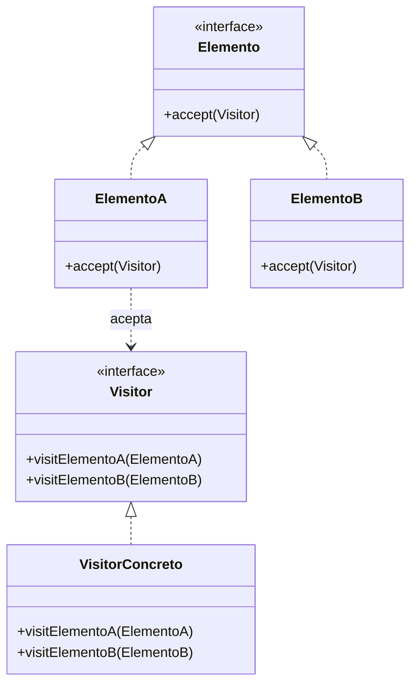

# Visitor (Visitante)

## ¿Qué es?
El **Visitor** es un patrón de diseño **de comportamiento** que permite separar un algoritmo de la estructura de objetos sobre la que opera. De esta forma, puedes añadir nuevas operaciones a una estructura de objetos existente sin modificar sus clases.

Arquitectónicamente, el Visitor es una forma de lograr el **Polimorfismo de Doble Despacho** (Double Dispatch), permitiendo que la operación ejecutada dependa tanto del tipo del visitante como del tipo del elemento visitado.

## Problema que intenta resolver
El problema surge cuando tienes una estructura de objetos compleja (ej. un árbol de componentes de UI o un grafo de nodos) y necesitas realizar diversas operaciones no relacionadas sobre ellos (ej. exportar a XML, calcular estadísticas, cambiar colores).

Si añades estas operaciones directamente en las clases de los elementos:
1. **Contaminación de Clases:** Las clases de los elementos se llenan de lógica que no es su responsabilidad principal (ej. una clase `Circulo` no debería saber cómo exportarse a XML).
2. **Violación del OCP:** Cada vez que necesites una operación nueva, debes modificar todas las clases de la jerarquía.
3. **Mantenimiento Difícil:** El código de una misma funcionalidad (ej. exportación) queda disperso por muchas clases diferentes.

## Situación sin patrón
Operaciones mezcladas con la lógica del objeto:

```java
// Diseño ingenuo: Los objetos conocen todas las operaciones extra
interface Forma {
    void dibujar();
    void exportarXML(); // ¿Y si luego quiero exportar a JSON?
    void calcularArea(); // ¿Y si luego quiero calcular el perímetro?
}

class Circulo implements Forma {
    public void dibujar() { /* ... */ }
    public void exportarXML() { System.out.println("<circle>...</circle>"); }
    public void calcularArea() { /* ... */ }
}
```

### Problemas del diseño ingenuo:
1. **Falta de Cohesión:** La clase `Circulo` sabe demasiado sobre formatos de exportación.
2. **Rigidez:** Añadir `exportarJSON()` requiere abrir y modificar `Forma`, `Circulo`, `Cuadrado`, etc.

## Idea principal del patrón
La filosofía es **"Externalizar las operaciones y dejar que el objeto 'acepte' al visitante"**. 
En lugar de que el objeto tenga el método `exportarXML()`, el objeto tiene un método genérico `aceptar(Visitante v)`. El Visitante es un objeto externo que contiene la lógica de la operación. Cuando el objeto acepta al visitante, le dice: "Oye, soy un Círculo, ejecútame tu lógica para círculos".

## Cómo funciona
1. **Visitante (Interfaz):** Declara un conjunto de métodos de visita, uno para cada clase de elemento concreto.
2. **Visitante Concreto:** Implementa una operación específica (ej. `ExportadorXMLVisitor`).
3. **Elemento (Interfaz):** Declara el método `accept(Visitor)`.
4. **Elemento Concreto:** Implementa `accept(Visitor)` llamando al método correspondiente del visitante (ej. `visitor.visitCirculo(this)`).

## UML del patrón

### UML Mermaid


## Implementación esencial en Java

```java
// 1. Interfaz Visitante
interface Visitor {
    void visitCirculo(Circulo c);
    void visitCuadrado(Cuadrado cu);
}

// 2. Interfaz Elemento
interface Forma {
    void accept(Visitor v);
}

// 3. Elementos Concretos
class Circulo implements Forma {
    public double radio;
    public void accept(Visitor v) { v.visitCirculo(this); } // Doble despacho
}

class Cuadrado implements Forma {
    public double lado;
    public void accept(Visitor v) { v.visitCuadrado(this); }
}

// 4. Visitante Concreto
class ExportadorXML implements Visitor {
    public void visitCirculo(Circulo c) {
        System.out.println("<circle radius='" + c.radio + "' />");
    }
    public void visitCuadrado(Cuadrado cu) {
        System.out.println("<square side='" + cu.lado + "' />");
    }
}
```

## Relación con SOLID y POO
1. **Open/Closed Principle (OCP):** Puedes añadir nuevas operaciones (nuevos Visitantes) sin tocar las clases de los elementos.
2. **Single Responsibility Principle (SRP):** Mueves las operaciones relacionadas a una sola clase (el Visitante).
3. **Double Dispatch:** El método ejecutado depende del tipo de la Forma y del tipo del Visitante.

## Trade-offs (Ventajas y Desventajas)
- **Ventaja:** Excelente para añadir operaciones sobre estructuras de objetos complejas. Mantiene las clases de datos limpias de lógica de procesamiento.
- **Desventaja:** **Inflexibilidad en la Jerarquía de Elementos**. Si añades una nueva clase de elemento (ej. `Triangulo`), tienes que modificar la interfaz `Visitor` y **todos** sus visitantes concretos.

## Cuándo usarlo y cuándo NO
- **Usar:** Cuando tienes una estructura de objetos estable (las clases de elementos no cambian casi nunca) pero necesitas añadir operaciones sobre ellos frecuentemente.
- **No usar:** Si tu jerarquía de elementos cambia constantemente, ya que el mantenimiento de los visitantes se volverá una pesadilla.
