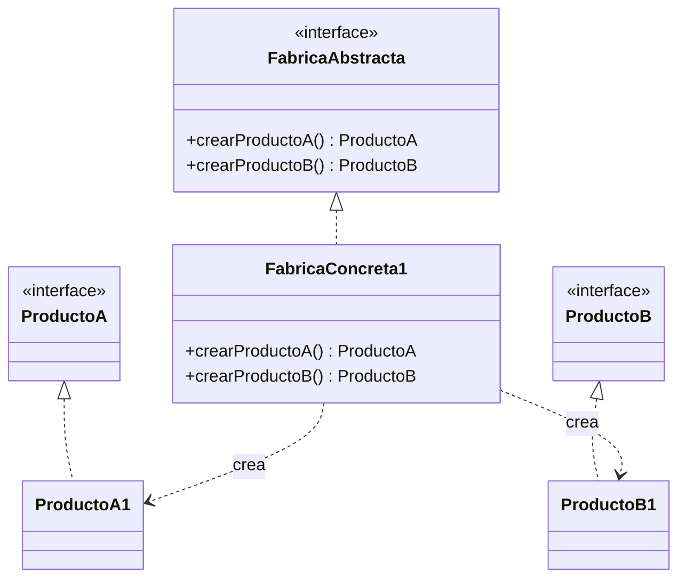

# Abstract Factory (Fábrica Abstracta)

## ¿Qué es?
El **Abstract Factory** es un patrón de diseño **creacional** que permite producir familias de objetos relacionados o dependientes sin especificar sus clases concretas.

Arquitectónicamente, es una evolución del Factory Method. Mientras que un Factory Method se encarga de crear *un único tipo* de objeto delegando a sus subclases, la Abstract Factory declara una interfaz para crear un *conjunto* de objetos que conceptualmente forman una "familia".

## Problema que intenta resolver
El problema principal es garantizar la **coherencia entre objetos**.
Imagina que estás desarrollando un sistema que debe funcionar con diferentes estilos o variantes (ej. un sistema de Muebles que puede ser de estilo "Moderno" o "Victoriano", o una interfaz gráfica para "Windows" y "Mac"). 

Si instanciamos los productos individualmente esparcidos por el código, corremos el riesgo de mezclar objetos incompatibles (ej. usar un botón de Windows dentro de una ventana de Mac).

## Situación sin patrón
Supongamos que creamos los objetos directamente donde se necesitan usando condiciones:

```java
// Diseño ingenuo: Riesgo de inconsistencia
public class InterfazGrafica {
    public void renderizar(String sistemaOperativo) {
        Boton boton;
        Casilla casilla;

        if (sistemaOperativo.equals("Windows")) {
            boton = new BotonWindows();
            casilla = new CasillaMac(); // ¡Error! Inconsistencia por descuido
        } else {
            boton = new BotonMac();
            casilla = new CasillaMac();
        }

        boton.dibujar();
        casilla.dibujar();
    }
}
```

### Problemas del diseño ingenuo:
1. **Falta de coherencia:** Es fácil cometer errores e instanciar objetos de distintas familias por accidente.
2. **Código espagueti:** Las sentencias `if/else` o `switch` se esparcen por todo el código cliente.
3. **Rigidez:** Añadir una nueva familia (ej. "Linux") obliga a modificar todos los lugares donde se crean los objetos (violación del OCP).

## Idea principal del patrón
La filosofía es **agrupar la creación de productos relacionados en una única fábrica abstracta**.
Se define una interfaz (`FábricaAbstracta`) que declara métodos para crear cada producto de la familia. Luego, se crean `FábricasConcretas` que implementan esa interfaz para producir los objetos de una variante específica. 
El cliente usa la fábrica a través de la interfaz, asegurándose de que todos los objetos creados por esa fábrica son compatibles entre sí.

## Cómo funciona
1. **Productos Abstractos (Interfaces):** Definen la interfaz para cada tipo de producto de la familia (ej. `Silla`, `Mesa`).
2. **Productos Concretos:** Implementaciones de los productos para variantes específicas (ej. `SillaModerna`, `MesaModerna`).
3. **Fábrica Abstracta (Interfaz):** Declara un grupo de métodos de creación, uno por cada producto abstracto.
4. **Fábricas Concretas:** Implementan la fábrica abstracta para devolver instancias de los productos concretos de una variante en particular.

## UML del patrón

### UML Mermaid


## Implementación esencial en Java

```java
// 1. Productos Abstractos (Familia)
interface Boton { void pintar(); }
interface Checkbox { void pintar(); }

// 2. Productos Concretos (Variante Windows)
class BotonWindows implements Boton {
    public void pintar() { System.out.println("Botón estilo Windows"); }
}
class CheckboxWindows implements Checkbox {
    public void pintar() { System.out.println("Checkbox estilo Windows"); }
}

// 2. Productos Concretos (Variante Mac)
class BotonMac implements Boton {
    public void pintar() { System.out.println("Botón estilo Mac"); }
}
class CheckboxMac implements Checkbox {
    public void pintar() { System.out.println("Checkbox estilo Mac"); }
}

// 3. Fábrica Abstracta
interface FabricaGUI {
    Boton crearBoton();
    Checkbox crearCheckbox();
}

// 4. Fábricas Concretas
class FabricaWindows implements FabricaGUI {
    public Boton crearBoton() { return new BotonWindows(); }
    public Checkbox crearCheckbox() { return new CheckboxWindows(); }
}

class FabricaMac implements FabricaGUI {
    public Boton crearBoton() { return new BotonMac(); }
    public Checkbox crearCheckbox() { return new CheckboxMac(); }
}

// Uso del cliente: El cliente NO sabe si usa Windows o Mac, la fábrica le da objetos consistentes
class Aplicacion {
    private Boton boton;
    private Checkbox checkbox;

    public Aplicacion(FabricaGUI fabrica) {
        boton = fabrica.crearBoton();
        checkbox = fabrica.crearCheckbox();
    }

    public void pintarUI() {
        boton.pintar();
        checkbox.pintar();
    }
}
```

## Relación con SOLID y POO
1. **Open/Closed Principle (OCP):** Es fácil introducir nuevas familias de productos (ej. `FabricaLinux`) sin romper el código cliente.
2. **Single Responsibility Principle (SRP):** Extrae la lógica de creación de objetos relacionados a un único lugar.
3. **Inversión de Dependencias (DIP):** El cliente depende de la abstracción (`FabricaGUI`), no de las implementaciones concretas.

## Trade-offs (Ventajas y Desventajas)
- **Ventajas:** 
  - Asegura que los productos que usas son compatibles entre sí.
  - Evita el acoplamiento fuerte entre el cliente y los productos concretos.
- **Desventaja (El problema del "Eje de Extensibilidad"):** Aunque es fácil añadir *nuevas familias* (nuevas fábricas concretas), es **muy difícil añadir nuevos productos** a la familia (ej. añadir un `Menu` a la `FabricaGUI`), porque obliga a modificar la interfaz `FabricaAbstracta` y todas sus fábricas concretas.

## Cuándo usarlo y cuándo NO
- **Usar:** Cuando el sistema deba configurarse con una de múltiples familias de productos y necesites asegurar que los productos de una familia no se mezclen con los de otra.
- **No usar:** Si no tienes una "familia" de productos relacionados, este patrón introduce una complejidad innecesaria de múltiples interfaces y clases. En ese caso, un simple Factory Method es suficiente.
