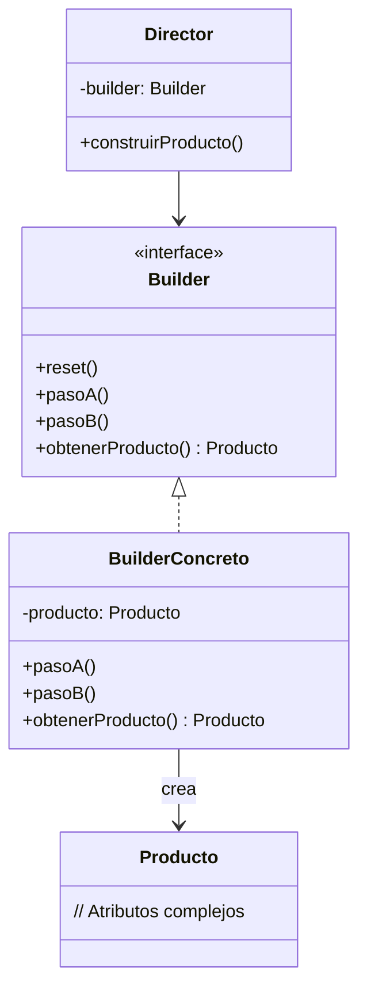

# Builder (Constructor)

## ¿Qué es?
El **Builder** es un patrón de diseño **creacional** que permite construir objetos complejos paso a paso. A diferencia de otros patrones creacionales, el Builder no requiere que el producto tenga una interfaz común, y permite producir diferentes tipos y representaciones de un objeto utilizando el mismo proceso de construcción.

Arquitectónicamente, separa la **lógica de construcción** de la **representación final** del objeto.

## Problema que intenta resolver
El problema principal es el **"Constructor Telescópico"**. Cuando una clase tiene muchos parámetros opcionales, terminamos con constructores gigantes o múltiples sobrecargas que son difíciles de leer y mantener.
Además, cuando la creación de un objeto implica pasos complejos o un orden específico, poner esa lógica en el constructor ensucia la clase y la hace menos cohesiva.

## Situación sin patrón
Imagina la creación de una clase `Casa` con múltiples atributos opcionales:

```java
// Diseño ingenuo: Constructor telescópico
public class Casa {
    public Casa(int ventanas, int puertas, boolean tieneGaraje, boolean tienePiscina, boolean tieneJardin) { 
        // ... 
    }
    
    // Si solo quiero casa con ventanas y puertas, necesito otra sobrecarga:
    public Casa(int ventanas, int puertas) { 
        // ... 
    }
}

// Uso: Es confuso saber qué significa cada parámetro (especialmente los booleanos)
Casa casa = new Casa(4, 2, true, false, true); 
```

### Problemas del diseño ingenuo:
1. **Falta de legibilidad:** Es fácil confundir el orden de los parámetros.
2. **Inflexibilidad:** Añadir un nuevo atributo opcional obliga a cambiar o añadir constructores.
3. **Objetos inconsistentes:** Si la construcción falla a mitad, podrías terminar con un objeto parcialmente configurado.

## Idea principal del patrón
La filosofía es extraer el código de construcción del objeto fuera de su propia clase y colocarlo en objetos independientes llamados **builders**. 
La construcción se realiza ejecutando una serie de pasos. No es necesario invocar todos los pasos, solo los necesarios para configurar la representación específica del objeto que necesitamos.

## Cómo funciona
1. **Producto:** El objeto complejo que se está construyendo.
2. **Builder (Interfaz):** Declara los pasos de construcción comunes a todos los tipos de builders.
3. **Builder Concreto:** Implementa los pasos y mantiene el resultado de la construcción.
4. **Director (Opcional):** Define el orden en el que se deben llamar los pasos de construcción para crear configuraciones específicas (ej. "Casa Lujosa", "Casa Básica").

## UML del patrón

### UML Mermaid


## Implementación esencial en Java

```java
// 1. Producto
class Casa {
    public int ventanas;
    public boolean tienePiscina;
    public String techo;
    // ... otros atributos
}

// 2. Interfaz Builder
interface CasaBuilder {
    void buildVentanas(int n);
    void buildPiscina(boolean p);
    void buildTecho(String t);
    Casa getResult();
}

// 3. Builder Concreto
class CasaLujoBuilder implements CasaBuilder {
    private Casa casa = new Casa();

    public void buildVentanas(int n) { casa.ventanas = n; }
    public void buildPiscina(boolean p) { casa.tienePiscina = p; }
    public void buildTecho(String t) { casa.techo = "Techo de Tejas"; }
    public Casa getResult() { return casa; }
}

// 4. Director
class Director {
    public void construirCasaConPiscina(CasaBuilder builder) {
        builder.buildVentanas(4);
        builder.buildPiscina(true);
        builder.buildTecho("Moderno");
    }
}
```

## Relación con SOLID y POO
1. **Single Responsibility Principle (SRP):** Separas la construcción compleja de la lógica de negocio del producto.
2. **Encapsulamiento:** El proceso de construcción está oculto; el cliente solo pide "lo que quiere" pero no sabe "cómo se ensambla".

## Trade-offs (Ventajas y Desventajas)
- **Ventaja:** Permite variar la representación interna de un producto. Control fino sobre el proceso de construcción.
- **Desventaja:** Aumenta la complejidad global del código al requerir múltiples clases nuevas (Builder, Director, etc.).

## Cuándo usarlo y cuándo NO
- **Usar:** Cuando la creación de un objeto implica muchos parámetros opcionales o cuando el proceso de creación debe permitir diferentes representaciones del mismo objeto.
- **No usar:** Si el objeto es simple, tiene pocos parámetros o no se prevé que su estructura de construcción cambie, ya que el patrón introduce mucha "ceremonia" de código.
