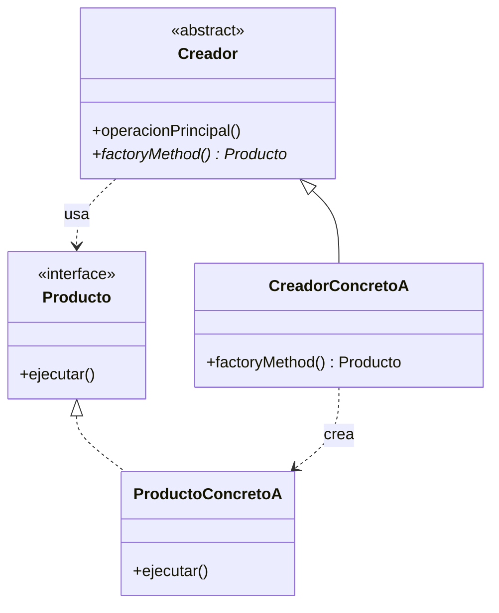

# Factory Method (Método de Fábrica)

## ¿Qué es?
El **Factory Method** es un patrón de diseño **creacional** que define una interfaz para crear un objeto, pero permite a las subclases decidir qué clase instanciar. 

Arquitectónicamente, este patrón permite que una clase delegue la responsabilidad de la instanciación a sus subclases, logrando un desacoplamiento entre el "creador" y los "productos concretos".

## Problema que intenta resolver
El problema principal es el **acoplamiento fuerte** derivado del uso directo del operador `new`. 
Cuando una clase (el cliente o creador) sabe exactamente qué clase concreta instanciar, el sistema se vuelve rígido. Si en el futuro queremos cambiar el tipo de objeto creado o añadir nuevas variantes, tenemos que modificar el código existente, violando la extensibilidad.

## Situación sin patrón
Imagina una aplicación de logística que solo maneja camiones:

```java
// Diseño ingenuo y acoplado
public class Logistica {
    public void planificarEntrega() {
        Camion camion = new Camion(); // Acoplamiento directo
        camion.entregar();
    }
}
```

### Problemas del diseño ingenuo:
1. **Rigidez:** Si mañana necesitamos agregar barcos, debemos modificar la clase `Logistica`.
2. **Violación del OCP (Open/Closed Principle):** El código no está cerrado para la modificación.
3. **Dependencia de implementaciones:** La lógica de negocio depende de clases concretas (`Camion`) en lugar de abstracciones.

## Idea principal del patrón
La filosofía es **"Programar para una interfaz, no para una implementación"**. 
En lugar de crear objetos directamente, llamamos a un "método de fábrica". Este método actúa como un punto de extensión que las subclases pueden sobrescribir para cambiar el tipo de producto que se creará, sin que la lógica principal de la clase base cambie.

## Cómo funciona
1. **Producto (Interfaz):** Define la interfaz de los objetos que el método de fábrica crea.
2. **Productos Concretos:** Implementaciones reales de la interfaz.
3. **Creador (Clase Abstracta):** Declara el método de fábrica (que devuelve un Producto) y contiene la lógica de negocio que utiliza dichos productos.
4. **Creadores Concretos:** Sobrescriben el método de fábrica para devolver una instancia de un Producto Concreto específico.

## UML del patrón

### UML Mermaid


## Implementación esencial en Java

```java
// 1. Interfaz de Producto
interface Transporte {
    void entregar();
}

// 2. Productos Concretos
class Camion implements Transporte {
    public void entregar() { System.out.println("Entrega por tierra"); }
}

class Barco implements Transporte {
    public void entregar() { System.out.println("Entrega por mar"); }
}

// 3. Creador (Clase Base)
abstract class Logistica {
    public void gestionarEntrega() {
        Transporte t = crearTransporte(); // Uso del Factory Method
        t.entregar();
    }
    
    // El método de fábrica
    public abstract Transporte crearTransporte();
}

// 4. Creadores Concretos
class LogisticaTerrestre extends Logistica {
    public Transporte crearTransporte() { return new Camion(); }
}

class LogisticaMaritima extends Logistica {
    public Transporte crearTransporte() { return new Barco(); }
}
```

## Relación con SOLID y POO
1. **Open/Closed Principle (OCP):** Puedes introducir nuevos tipos de productos sin romper el código cliente existente.
2. **Single Responsibility Principle (SRP):** Mueves el código de creación de productos a un lugar específico, separándolo de la lógica de negocio.
3. **Polimorfismo:** El creador base utiliza el producto de forma polimórfica a través de la interfaz.

## Trade-offs (Ventajas y Desventajas)
- **Ventaja:** Elimina el acoplamiento entre el creador y los productos concretos.
- **Desventaja:** El código puede volverse más complejo debido a la necesidad de crear muchas subclases nuevas para cada tipo de producto.

## Cuándo usarlo y cuándo NO
- **Usar:** Cuando no sabes de antemano los tipos exactos de objetos con los que tu código debe funcionar o cuando quieres permitir que otros extiendan los componentes internos de tu arquitectura.
- **No usar:** Si la jerarquía de productos es muy simple y no se prevé que crezca, ya que añade una capa de abstracción innecesaria.
