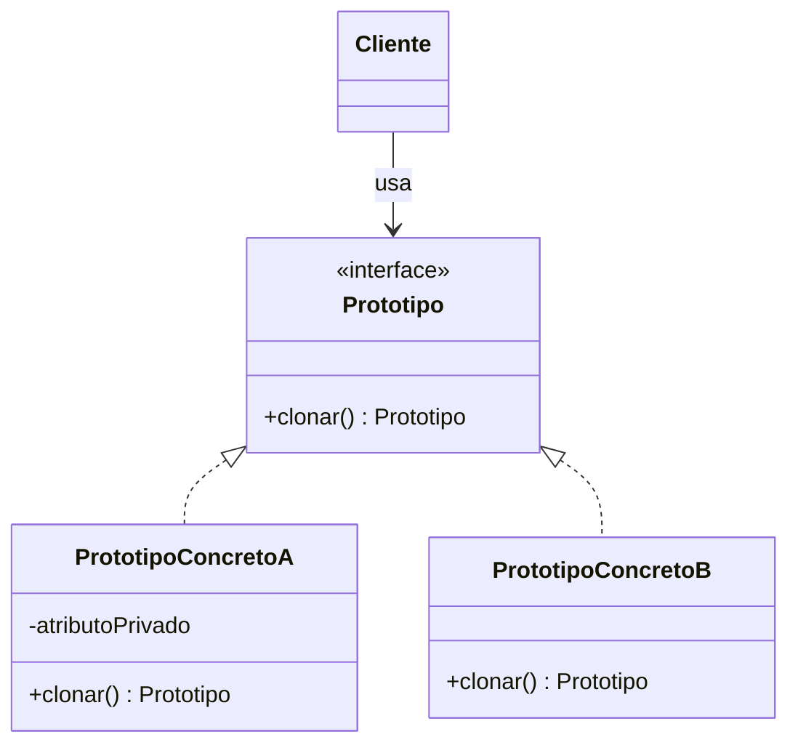

# Prototype (Prototipo)

## ¿Qué es?
El **Prototype** es un patrón de diseño **creacional** que permite copiar objetos existentes sin que el código dependa de sus clases.

Arquitectónicamente, este patrón propone que un objeto sepa cómo clonarse a sí mismo. En lugar de instanciar un objeto desde cero (lo cual puede ser costoso o complejo), pedimos a un objeto ya existente (el prototipo) que nos entregue una copia exacta.

## Problema que intenta resolver
El problema principal surge cuando queremos crear una copia exacta de un objeto, pero:
1. **Atributos Privados:** No podemos acceder a todos los campos del objeto desde fuera para copiarlos.
2. **Acoplamiento:** Para copiar el objeto, necesitaríamos saber su clase concreta, lo que nos acopla a ella.
3. **Costo de Creación:** A veces, crear un objeto desde cero implica operaciones pesadas (consultas a BD, cálculos complejos) que ya se realizaron para el objeto original.

## Situación sin patrón
Intentar copiar un objeto manualmente desde el cliente:

```java
// Diseño ingenuo: El cliente debe conocer la clase y sus atributos
public class Cliente {
    public void duplicarCirculo(Circulo c1) {
        Circulo c2 = new Circulo();
        c2.radio = c1.radio;
        c2.color = c1.color;
        // ¿Y si tiene atributos privados? No podemos copiarlos.
        // ¿Y si c1 es en realidad una subclase de Circulo? Se pierde la especialización.
    }
}
```

### Problemas del diseño ingenuo:
1. **Acceso Restringido:** El cliente no puede copiar lo que no puede ver (atributos `private`).
2. **Dependencia:** El cliente debe conocer la clase exacta del objeto que está copiando.
3. **Inflexibilidad:** Si el objeto tiene una jerarquía compleja, el cliente tendría que hacer múltiples chequeos de tipo (`instanceof`).

## Idea principal del patrón
La filosofía es **delegar la responsabilidad del clonado al propio objeto**. 
El objeto original actúa como un "prototipo". Declaramos una interfaz común que tiene un método `clonar()`. Cualquier objeto que implemente esta interfaz debe ser capaz de crear una copia de sí mismo, manejando internamente sus propios atributos privados.

## Cómo funciona
1. **Prototipo (Interfaz):** Declara el método para clonarse (normalmente `clonar()`).
2. **Prototipo Concreto:** Implementa el método de clonado creando un nuevo objeto de su misma clase y copiando todos los valores de sus atributos (incluyendo los privados).
3. **Cliente:** Crea un nuevo objeto pidiendo al prototipo que se clone.

## UML del patrón

### UML Mermaid


## Implementación esencial en Java

```java
// 1. Interfaz Prototipo
interface Shape {
    Shape clone();
    void draw();
}

// 2. Prototipos Concretos
class Circle implements Shape {
    private int radius;
    private String color;

    public Circle(int radius, String color) {
        this.radius = radius;
        this.color = color;
    }

    // Constructor de copia (útil para el clonado)
    public Circle(Circle source) {
        this.radius = source.radius;
        this.color = source.color;
    }

    @Override
    public Shape clone() {
        return new Circle(this);
    }

    @Override
    public void draw() { System.out.println("Círculo de radio " + radius); }
}

// 3. Cliente
class RegistroPrototipos {
    public void ejecutar() {
        Circle circuloOriginal = new Circle(10, "Rojo");
        
        // El cliente clona sin saber los detalles internos
        Circle copia = (Circle) circuloOriginal.clone();
        copia.draw();
    }
}
```

## Relación con SOLID y POO
1. **Open/Closed Principle (OCP):** Puedes añadir nuevos prototipos concretos sin cambiar el código del cliente que realiza el clonado.
2. **Encapsulamiento:** Solo el objeto conoce sus campos privados, por lo tanto, solo él es el indicado para copiarlos correctamente.

## Trade-offs (Ventajas y Desventajas)
- **Ventajas:** 
  - Permite clonar objetos sin acoplarse a sus clases concretas.
  - Evita procesos de inicialización costosos.
  - Permite copiar objetos complejos con atributos privados de forma segura.
- **Desventajas:**
  - El clonado de objetos que tienen **referencias circulares** puede ser muy complicado.
  - Requiere que cada clase implemente la lógica de clonado, lo cual puede ser tedioso en jerarquías grandes.

## Cuándo usarlo y cuándo NO
- **Usar:** Cuando el costo de crear un objeto es mayor que el de clonarlo, o cuando quieres evitar que tu código dependa de las clases concretas de los objetos que necesitas copiar.
- **No usar:** Si los objetos son simples, no tienen atributos privados que necesiten ser copiados y su creación no es costosa. En estos casos, el uso de `new` es preferible por simplicidad.
