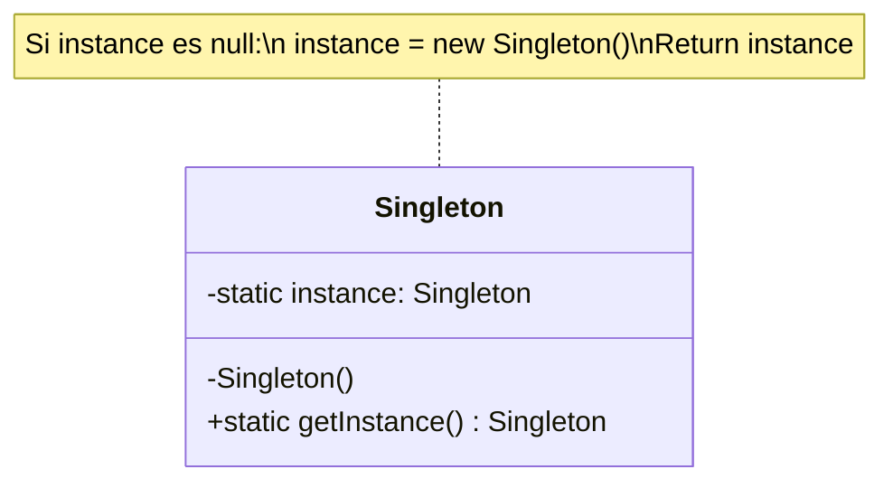

# Singleton (Instancia Única)

## ¿Qué es?
El patrón **Singleton** es un patrón de diseño de tipo **creacional** cuyo objetivo principal es garantizar que una clase tenga **una única instancia** y proporcionar un **punto de acceso global** a dicha instancia.

Desde una perspectiva arquitectónica, el Singleton actúa como un "objeto de control" o "recurso compartido" centralizado. No es simplemente una variable global; es una estructura que encapsula su propio proceso de instanciación para asegurar la integridad de un recurso que, por naturaleza, no debería ser duplicado.

## Problema que intenta resolver
En muchos sistemas, existen componentes que deben ser únicos para mantener la coherencia del estado o el control sobre un recurso físico/lógico limitado. Ejemplos comunes:
- Gestores de conexión a bases de datos (Pools).
- Sistemas de Loggers.
- Motores de configuración global.
- Acceso a hardware específico (impresoras, sensores).

El problema surge cuando múltiples partes de la aplicación intentan crear sus propias copias de estos objetos, lo que lleva a:
1. **Consumo excesivo de recursos:** (ej. 100 conexiones a DB innecesarias).
2. **Inconsistencia de estado:** (ej. dos objetos de configuración con valores diferentes).
3. **Conflictos de acceso:** (ej. dos hilos intentando escribir simultáneamente en el mismo archivo de log sin coordinación).

## Situación sin patrón
Imagina un sistema de configuración donde cada clase que necesita una configuración crea su propia instancia:

```java
// Diseño Ingenuo
public class Configuration {
    private String dbUrl;
    
    public Configuration() {
        // Carga costosa desde un archivo
        this.dbUrl = "jdbc:mysql://localhost:3306/mydb";
    }
}

// Uso en múltiples servicios
public class ServiceA {
    private Configuration config = new Configuration(); // Instancia 1
}

public class ServiceB {
    private Configuration config = new Configuration(); // Instancia 2
}
```

### Problemas del diseño ingenuo:
1. **Acoplamiento Espacial:** Los clientes (`ServiceA`, `ServiceB`) son responsables de crear la configuración. Si la forma de crearla cambia, hay que modificar todos los clientes.
2. **Falta de Control:** No hay forma de evitar que alguien haga `new Configuration()`.
3. **Inexistencia de Identidad Única:** `ServiceA` y `ServiceB` operan sobre objetos distintos, lo que rompe la noción de "Configuración Global".

## Idea principal del patrón
La filosofía del Singleton es **trasladar la responsabilidad de la creación y el control de la instancia a la propia clase**. En lugar de permitir que el mundo exterior cree objetos, la clase se vuelve "egoísta": ella misma se crea, se guarda y se entrega cuando alguien la solicita.

Aplica el principio de **Encapsulamiento** de forma extrema al proceso de instanciación.

## Cómo funciona
La mecánica interna se basa en tres pilares:
1. **Constructor Privado:** Evita que se use el operador `new` desde fuera de la clase.
2. **Atributo Estático Privado:** Almacena la única instancia de la clase.
3. **Método Estático Público (`getInstance`):** Actúa como el guardián. Si la instancia no existe, la crea; si ya existe, devuelve la existente.

## UML del patrón

### UML ASCII
```text
+---------------------------+
|         Singleton         |
+---------------------------+
| - instance: Singleton     | [Estático]
+---------------------------+
| - Singleton()             | [Privado]
| + getInstance(): Singleton| [Estático]
+---------------------------+
```

### UML Mermaid


## Implementación en Java

### 1. Lazy Initialization (No Thread-Safe)
Ideal para entornos monohilo donde el recurso es costoso y solo debe crearse si se usa.
```java
public class SingletonLazy {
    private static SingletonLazy instance;

    private SingletonLazy() {}

    public static SingletonLazy getInstance() {
        if (instance == null) {
            instance = new SingletonLazy();
        }
        return instance;
    }
}
```

### 2. Thread-Safe (Double-Checked Locking)
La forma clásica y robusta para entornos multihilo.
```java
public class SingletonThreadSafe {
    // volatile asegura visibilidad entre hilos
    private static volatile SingletonThreadSafe instance;

    private SingletonThreadSafe() {}

    public static SingletonThreadSafe getInstance() {
        if (instance == null) { // Primer check (sin bloqueo)
            synchronized (SingletonThreadSafe.class) {
                if (instance == null) { // Segundo check (con bloqueo)
                    instance = new SingletonThreadSafe();
                }
            }
        }
        return instance;
    }
}
```

### 3. El enfoque moderno: Enum Singleton
Es la implementación recomendada por Joshua Bloch (Effective Java). Proporciona protección gratuita contra la serialización y ataques de reflexión.
```java
public enum SingletonEnum {
    INSTANCE;
    
    public void doSomething() {
        // Lógica del negocio
    }
}
```

## Relación con SOLID y POO

1. **Single Responsibility Principle (SRP):** Aquí hay un **trade-off**. Técnicamente, la clase viola el SRP porque hace dos cosas: realiza su lógica de negocio y además gestiona su propio ciclo de vida. Sin embargo, en patrones de diseño, esta es una decisión deliberada para garantizar la unicidad.
2. **Encapsulamiento:** Es el núcleo del patrón. Ocultamos el *cómo* y el *cuándo* se crea el objeto.
3. **Abstracción:** El cliente no necesita saber cómo se gestiona la instancia, solo confía en el contrato de `getInstance()`.

## Trade-offs (Ventajas y Desventajas)

### Ventajas:
- **Control estricto de acceso:** Punto único de entrada.
- **Reducción del espacio de nombres:** Evita variables globales que ensucian el código.
- **Lazy Loading:** El objeto solo se crea cuando es estrictamente necesario.

### Desventajas:
- **Dificultad en Pruebas Unitarias:** El estado global es el enemigo de los tests. No puedes resetear fácilmente la instancia entre pruebas, lo que genera dependencias entre tests.
- **Oculta Dependencias:** Al llamar a `Singleton.getInstance()` dentro de un método, la dependencia no es explícita en el constructor (genera acoplamiento oculto).
- **Problemas en Sistemas Distribuidos:** En entornos con múltiples JVMs o ClassLoaders, puedes terminar con múltiples "Singletons".

## Cuándo usarlo y cuándo NO

### Úsalo cuando:
- El recurso debe ser **estrictamente único** (ej. Driver de hardware).
- Necesitas un punto de acceso global que sea más controlado que una variable global.
- Quieres implementar otros patrones como **Abstract Factory** o **Builder** que suelen ser Singletons.

### NO lo uses cuando:
- Solo quieres pasar información entre clases (usa Inyección de Dependencias).
- Te importa mucho la "testeabilidad" del código (considera usar un contenedor de DI como Spring o Dagger que gestione el ciclo de vida por ti).
- La clase tiene estado que cambia frecuentemente y es accedido por muchos hilos (puede convertirse en un cuello de botella).
