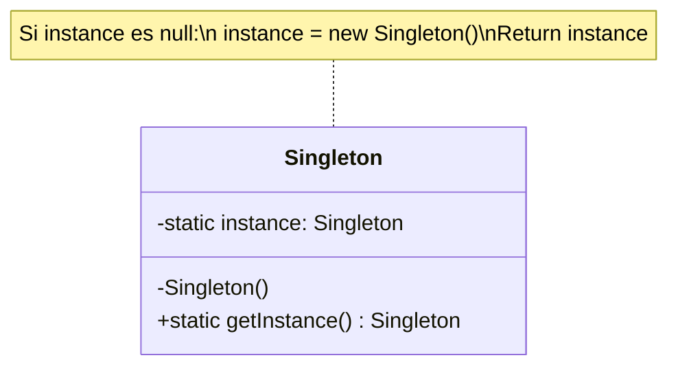

# Singleton (Instancia Única)

## ¿Qué es?
El patrón **Singleton** es un patrón de diseño de tipo **creacional** cuyo objetivo principal es garantizar que una clase tenga **una única instancia** y proporcionar un **punto de acceso global** a dicha instancia.

Desde una perspectiva arquitectónica, el Singleton actúa como un "objeto de control" o "recurso compartido" centralizado. No es simplemente una variable global; es una estructura que encapsula su propio proceso de instanciación para asegurar la integridad de un recurso que, por naturaleza, no debería ser duplicado.

## Problema que intenta resolver
En muchos sistemas, existen componentes que deben ser únicos para mantener la coherencia del estado o el control sobre un recurso físico/lógico limitado. Ejemplos comunes:
- Gestores de conexión a bases de datos (Pools).
- Sistemas de Loggers.
- Motores de configuración global.
- Acceso a hardware específico (impresoras, sensores).

El problema surge cuando múltiples partes de la aplicación intentan crear sus propias copias de estos objetos, lo que lleva a:
1. **Consumo excesivo de recursos:** (ej. 100 conexiones a DB innecesarias).
2. **Inconsistencia de estado:** (ej. dos objetos de configuración con valores diferentes).
3. **Conflictos de acceso:** (ej. dos hilos intentando escribir simultáneamente en el mismo archivo de log sin coordinación).

## Situación sin patrón
Imagina un sistema de configuración donde cada clase que necesita una configuración crea su propia instancia:

```java
// Diseño Ingenuo
public class Configuration {
    private String dbUrl;
    
    public Configuration() {
        // Carga costosa desde un archivo
        this.dbUrl = "jdbc:mysql://localhost:3306/mydb";
    }
}

// Uso en múltiples servicios
public class ServiceA {
    private Configuration config = new Configuration(); // Instancia 1
}

public class ServiceB {
    private Configuration config = new Configuration(); // Instancia 2
}
```

### Problemas del diseño ingenuo:
1. **Acoplamiento Espacial:** Los clientes (`ServiceA`, `ServiceB`) son responsables de crear la configuración. Si la forma de crearla cambia, hay que modificar todos los clientes.
2. **Falta de Control:** No hay forma de evitar que alguien haga `new Configuration()`.
3. **Inexistencia de Identidad Única:** `ServiceA` y `ServiceB` operan sobre objetos distintos, lo que rompe la noción de "Configuración Global".

## Idea principal del patrón
La filosofía del Singleton es **trasladar la responsabilidad de la creación y el control de la instancia a la propia clase**. En lugar de permitir que el mundo exterior cree objetos, la clase se vuelve "egoísta": ella misma se crea, se guarda y se entrega cuando alguien la solicita.

Aplica el principio de **Encapsulamiento** de forma extrema al proceso de instanciación.

## Cómo funciona
La mecánica interna se basa en tres pilares:
1. **Constructor Privado:** Evita que se use el operador `new` desde fuera de la clase.
2. **Atributo Estático Privado:** Almacena la única instancia de la clase.
3. **Método Estático Público (`getInstance`):** Actúa como el guardián. Si la instancia no existe, la crea; si ya existe, devuelve la existente.

## UML del patrón

### UML ASCII
```text
+---------------------------+
|         Singleton         |
+---------------------------+
| - instance: Singleton     | [Estático]
+---------------------------+
| - Singleton()             | [Privado]
| + getInstance(): Singleton| [Estático]
+---------------------------+
```

### UML Mermaid


## Implementación esencial en Java

```java
public class Singleton {
    // Atributo estático que guarda la instancia única
    private static Singleton instance;

    // Constructor privado para evitar instanciación externa
    private Singleton() {}

    // Método público para obtener la instancia
    public static Singleton getInstance() {
        if (instance == null) {
            instance = new Singleton();
        }
        return instance;
    }
}
```

## Relación con SOLID y POO
1. **Encapsulamiento:** Protege el proceso de creación.
2. **Abstracción:** El cliente solo interactúa con `getInstance()`.

## Trade-offs (Ventajas y Desventajas)
- **Ventaja:** Punto de acceso global y control de instancia única.
- **Desventaja:** Dificulta las pruebas unitarias por el estado global oculto.

## Cuándo usarlo y cuándo NO
- **Usar:** Para recursos que deben ser únicos (ej. Logger o Configuración).
- **No usar:** Si se puede resolver mediante inyección de dependencias.
